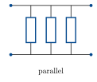
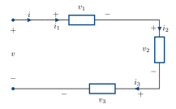
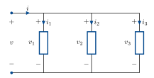
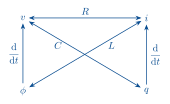
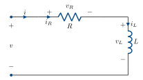

::: {.content-visible when-format="html"}
::: {.format-links}
[Other formats:]{.label}
```{=html}
<a href="notes.pdf" title="Primer on RLC circuits as a PDF"
   data-goatcounter-click="pdf-primer"
   data-goatcounter-title="Primer PDF opened">&#128196;&nbsp;PDF</a>
```
:::
:::

::: {.content-visible when-format="pdf"}
The web version of these notes is at
[tchaffey.com/elec2302](https://tchaffey.com/elec2302/?ref=notes-pdf-primer).
:::

RLC circuits are an important and useful class of LTI systems that are widely used in
analogue signal processing.

RLC circuits are interconnections of resistors (R), capacitors (C) and inductors (L)
that manipulate voltages and currents.

::: {style="text-align:center"}
{width=520}
:::

Current is the **flow** (rate of change) of charge (unit: Coulombs). It is measured in
Amperes, which are Coulombs/second.

Voltage is a difference in potential energy which forces current to flow. It is measured
in Volts, which are Joules/Coulomb.

RLC circuits are described by a couple of things:

- a **circuit diagram** which illustrates how components are interconnected and which
  component goes where.
- a choice of input(s): ideal voltage and current sources.
- a choice of output(s): the current(s) or voltage(s) that we measure.

The circuit is governed by two sets of laws:

**Kirchhoff's laws** describe the interconnection structure of the circuit diagram: how are
current and voltage related between components.

The **device laws** describe how the current and voltage are related across an individual
component.

Combining Kirchhoff's laws and the device laws gives a complete description of the circuit behaviour.

## Kirchhoff's laws for series &amp; parallel circuits

Kirchhoff's laws can be solved for an arbitrary circuit diagram, but in ELEC2302/9302, we
will only use two special cases: series and parallel circuits.

::: {.columns}
::: {.column width="42%"}
{width=200}
:::
::: {.column width="58%"}
{width=330}
:::
:::

Each device has a current flowing through it and a voltage across it.

::: {style="text-align:center"}
{width=300}
:::

By convention, current flows from + to −.

The current and voltage have a direction, which you can choose: the important thing is to
be consistent. If the actual current flows the other way, you will get a minus sign in your analysis.

For series and parallel circuits, Kirchhoff's laws say the following.

### Series circuit

::: {style="text-align:center"}
{width=520}
:::

**Kirchhoff's current law**: the current through devices in series is equal.
$i_1 = i_2 = i_3$.

**Kirchhoff's voltage law**: the voltages around the loop sum to zero.
$-v + v_1 + v_2 + v_3 = 0$. To get the sign of each voltage, follow $i$ around the loop
and take the sign of the terminal it enters for each device.

### Parallel circuit

::: {style="text-align:center"}
{width=520}
:::

**Kirchhoff's voltage law**: the voltage across devices in parallel is equal.
$v_1 = v_2 = v_3$.

**Kirchhoff's current law**: the sum of the currents through the devices equals the total
current $i$.

$$ i = i_1 + i_2 + i_3 . $$

<!-- CHECK: page 4 of the source spells this "Kirchoff's current law"; set as
"Kirchhoff's" to match the rest of the primer. -->

## Device laws

There are four fundamental quantities in a circuit: current $i(t)$, charge $q(t)$,
voltage $v(t)$ and magnetic flux linkage $\phi(t)$.

Current and charge are related by $\dfrac{\mathrm{d}}{\mathrm{d}t}\,q(t) = i(t)$.

Voltage and flux are related by $\dfrac{\mathrm{d}}{\mathrm{d}t}\,\phi(t) = v(t)$.

Resistors, capacitors and inductors each give a static linear relationship between two of
these variables.

::: {style="text-align:center"}
{width=380}
:::

Resistor: $v = Ri$ (Ohm's law).

Capacitor: $q = Cv$, or $i = \dfrac{\mathrm{d}}{\mathrm{d}t}\,Cv$.

Inductor: $\phi = Li$, or $v = \dfrac{\mathrm{d}}{\mathrm{d}t}\,Li$.

By combining Kirchhoff's laws and the device laws, we can completely solve a circuit.
Let's see how on an example.

## Example: series RL

::: {.columns}
::: {.column width="58%"}
{width=420}
:::
::: {.column width="42%"}
For now, let's solve in terms of arbitrary applied voltage and current, before choosing an
input.

Annotate the diagram with voltages and currents for the resistor and inductor.
:::
:::

Now follow the three standard steps: write down Kirchhoff's laws, write down the device
laws and combine.

In this case, the circuit is series, so we have:

$$ i = i_R = i_L. \qquad \text{(KCL)} $$

$$ v = v_R + v_L. \qquad \text{(KVL)} $$

Devices:

$$
\begin{aligned}
v_R &= R\,i_R \\[2pt]
v_L &= \frac{\mathrm{d}}{\mathrm{d}t}\,L\,i_L .
\end{aligned}
$$

Combine:

$$
\begin{aligned}
v_R &= R\,i \\[2pt]
v_L &= \frac{\mathrm{d}}{\mathrm{d}t}\,L\,i \\[2pt]
v   &= R\,i + \frac{\mathrm{d}}{\mathrm{d}t}\,L\,i .
\qquad(1)
\end{aligned}
$$

This describes the circuit. We can now choose a particular input and output to get a
system.

For example: input $v$, output $v_R$.

$v$ already features in equation (1). Let's eliminate $i$ and get an expression with
$v_R$.

$$ i = \frac{1}{R}\,v_R . $$

In (1):

$$ \boxed{\; v = v_R + \frac{\mathrm{d}}{\mathrm{d}t}\,\frac{L}{R}\,v_R \;} \qquad(2) $$

This is an equivalent description of the circuit with only the input and output variables
we're interested in.

Every circuit in the lectures and tutorials can be solved this way. Work through some
examples: parallel, RC and RLC.
