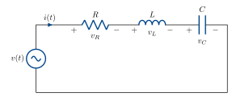

Signals &amp; Systems lives at the intersection of **differential equations**, **linear
algebra**, **complex numbers** and **trigonometry**.

## (a) The exponential function

For $z \in \mathbb{C}$, define the exponential by its power series:

$$ e^{z} := 1 + z + \frac{z^{2}}{2!} + \frac{z^{3}}{3!} + \cdots $$

**Properties.** First, $e^{0} = 1$ (straight from the definition) $\qquad(1)$

$$
\begin{aligned}
\frac{\mathrm{d}}{\mathrm{d}z}\,e^{z}
&= 0 + 1 + \frac{2z}{2!} + \frac{3z^{2}}{3!} + \cdots \\[2pt]
&= 1 + z + \frac{z^{2}}{2!} + \cdots \\[2pt]
&= e^{z}
\end{aligned}
\qquad(2)
$$

Combining the two properties:

$$ \boxed{\,f(z) = f'(z), \qquad f(0) = 1\,} $$

It turns out $f(z) = e^{z}$ is the unique solution to this differential equation, and in fact the differential equation can be used as an
alternative definition.

**Extension of (2).** By the chain rule,

$$
\frac{\mathrm{d}}{\mathrm{d}t}\,e^{zt}
= 0 + z + \frac{2t\,z^{2}}{2!} + \frac{3t^{2}z^{3}}{3!} + \cdots
= z\,e^{zt}.
$$

## (b) Euler's formula

Let's now represent sinusoids as complex numbers. Let

$$ g(\theta) = \frac{\cos\theta + j\sin\theta}{e^{j\theta}} . $$

Then

$$
\begin{aligned}
g'(\theta)
&= \big(-\sin\theta + j\cos\theta\big)e^{-j\theta}
   - \big(\cos\theta + j\sin\theta\big)\,j\,e^{-j\theta} \\[2pt]
&= \big(-\sin\theta + j\cos\theta\big)e^{-j\theta}
   - \big(-\sin\theta + j\cos\theta\big)e^{-j\theta} \\[2pt]
&= 0 .
\end{aligned}
$$

So $g(\theta) = C$ (a constant):

$$ C\,e^{j\theta} = \cos\theta + j\sin\theta . $$

Set $\theta = 0$. Then $C = 1$, so we have

$$ \boxed{\,e^{j\theta} = \cos\theta + j\sin\theta\,} $$

**What does this mean graphically?** $e^{j\theta}$ is the unit vector at angle $\theta$;
its real part is $\cos\theta$ and its imaginary part is $\sin\theta$. Advance $\theta$ and
the vector rotates, its shadow tracing a sinusoid.

```{=html}
<div id="w-euler" class="widget"></div>
```

In particular: $\;e^{j\pi/2} = j, \qquad e^{j\pi} = -1.$

### Manipulating sinusoids using complex numbers

Why use complex numbers to represent sinusoids? Because it makes the algebra easier. For example,

$$ x_1(t) = 3\cos\omega t, \qquad x_2(t) = 4\cos\!\big(\omega t + \tfrac{\pi}{2}\big),
   \qquad x_1(t) + x_2(t) = \;? $$

The direct way uses the identity $\cos(\theta + \tfrac{\pi}{2}) = -\sin\theta$, so
$x_2(t) = -4\sin\omega t$, giving

$$ 3\cos\omega t - 4\sin\omega t \;\equiv\; A\cos(\omega t + \varphi)
   \quad\longrightarrow\quad \text{match coefficients} \dots $$

With complex numbers:

$$
\begin{aligned}
x_1(t) &= \operatorname{Re}\!\big(3\,e^{j\omega t}\big) \\[2pt]
x_2(t) &= \operatorname{Re}\!\big(4\,e^{\,j\omega t + j\pi/2}\big)
        = \operatorname{Re}\!\big(4\,e^{j\pi/2}\,e^{j\omega t}\big)
        = \operatorname{Re}\!\big(4j\,e^{j\omega t}\big) \\[2pt]
x_1(t) + x_2(t)
        &= \operatorname{Re}\!\big(3\,e^{j\omega t} + 4j\,e^{j\omega t}\big) \\[2pt]
        &= \operatorname{Re}\!\big((3 + 4j)\,e^{j\omega t}\big) \\[2pt]
        &= \operatorname{Re}\!\big(5\,e^{j0.927}\,e^{j\omega t}\big)
        = 5\cos(\omega t + 0.927).
\end{aligned}
$$

```{=html}
<div id="w-sum" class="widget"></div>
```

The triangle $3 + 4j = 5\angle 53.1^{\circ}$ rotates.

## (c) Euler's formula &amp; differential equations

Another differential equation:

$$ \frac{\mathrm{d}}{\mathrm{d}t}\,x(t) = j\,x(t) \qquad(3) $$

We've already seen $\dfrac{\mathrm{d}}{\mathrm{d}t}e^{zt} = z\,e^{zt}$. Set $z = j$:

$$ \frac{\mathrm{d}}{\mathrm{d}t}\,e^{jt} = j\,e^{jt}. $$

This solves (3). What does it look like in $\mathbb{C}$, and what does the real part look
like? What about other choices of $z$?

$$ z = -1:\quad \frac{\mathrm{d}}{\mathrm{d}t}\,e^{-t} = -e^{-t}. \qquad\text{No imaginary component.} $$

$$ z = -1 + j:\quad \frac{\mathrm{d}}{\mathrm{d}t}\,e^{(-1+j)t} = (-1+j)\,e^{(-1+j)t}. $$

The widget below plots the trajectory of  $e^{zt}$ for several values of $z$.

```{=html}
<div id="w-ezt" class="widget"></div>
```

::: {.note}
The position of $z$ determines the behaviour: oscillations, decay, growth.
:::

## (d) What has this got to do with electrical engineering?

Example: an RLC circuit (the **system**) with a sinusoidal voltage input (the **signal**).

::: {style="text-align:center"}
{width=540}
:::

KVL around the loop:

$$ v(t) = v_R + v_L + v_C $$

$$ v(t) = R\,i(t) + L\,\frac{\mathrm{d}i(t)}{\mathrm{d}t}
   + \frac{1}{C}\!\int_{-\infty}^{t}\! i(\tau)\,\mathrm{d}\tau \qquad(4) $$

with the lower limit taken to $-\infty$ for the steady-state response. Let
$v(t) = V\cos\omega t = \operatorname{Re}(V e^{j\omega t})$ and look for a current of the
same form, $i(t) = \operatorname{Re}(I e^{j\omega t})$.

Substitute in (4):

$$
\begin{aligned}
V e^{j\omega t}
&= R I e^{j\omega t} + L\frac{\mathrm{d}}{\mathrm{d}t}I e^{j\omega t}
   + \frac{1}{C}\!\int\! I e^{j\omega\tau}\,\mathrm{d}\tau \\[2pt]
&= R I e^{j\omega t} + j\omega L\, I e^{j\omega t} + \frac{I}{j\omega C}\,e^{j\omega t} + \frac{K}{C},
\end{aligned}
$$
where $K$ is a constant of integration.  Matching coefficients of $e^{j\omega t}$, we find $K = 0$ ($K$ represents a residual charge on the capacitor, which a sinuosoidal voltage is not able to maintain at steady state).


Divide through by $e^{j\omega t}$ (never zero):

$$ V = I\underbrace{\Big(R + j\omega L + \tfrac{1}{j\omega C}\Big)}_{\text{impedance } Z(j\omega)}
   \qquad\Longrightarrow\qquad I = \frac{V}{Z}. $$

Suppose $R = 30\,\Omega$ and $\omega L - \tfrac{1}{\omega C} = 40\,\Omega$. Then

$$ Z = 30 + 40j = 50\,e^{j0.927}, \qquad I = \frac{V}{50\,e^{j0.927}}, $$

$$ i(t) = \operatorname{Re}(I e^{j\omega t}) = \frac{V}{50}\cos(\omega t - 0.927). $$

The widget below plots input and output sinusoids for several values of the reactance $Z$.  For some values, the output lags the input, while for others, the output leads.

```{=html}
<div id="w-rlc" class="widget"></div>
```

::: {.note}
The RLC circuit maps a sinusoid to a sinusoid with the **same frequency**. This is the
foundation of the rest of the course.
:::

```{=html}
<script src="phasor-widgets.js"></script>
```
