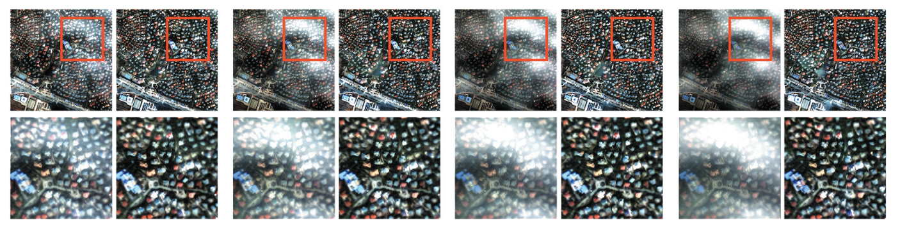
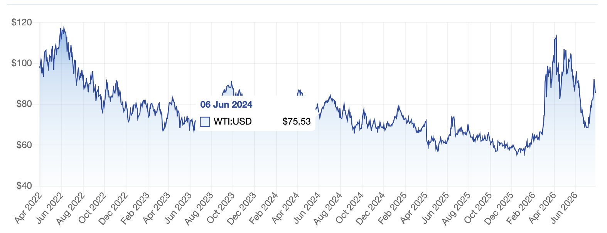
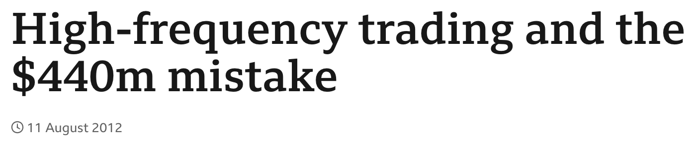
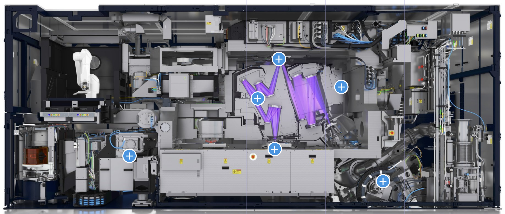
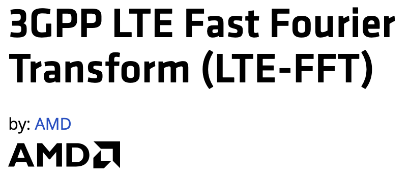
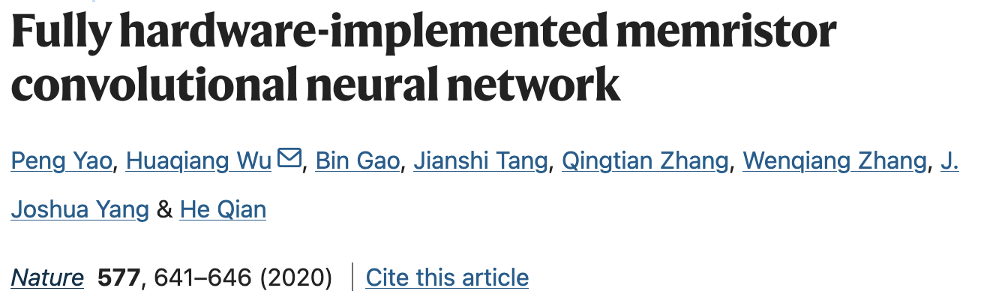
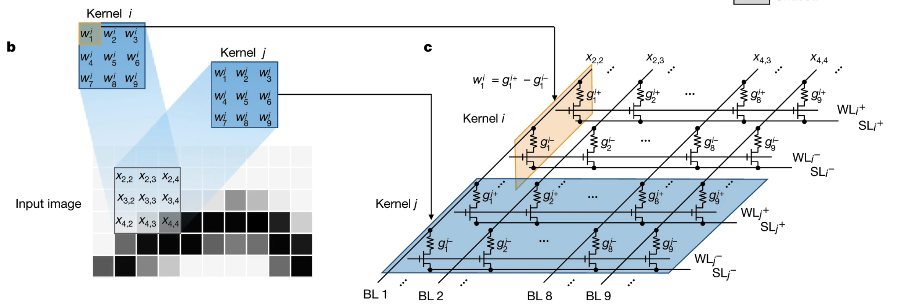
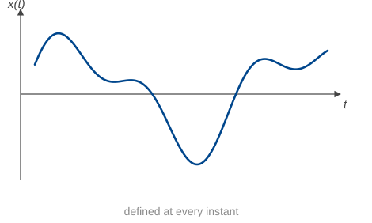
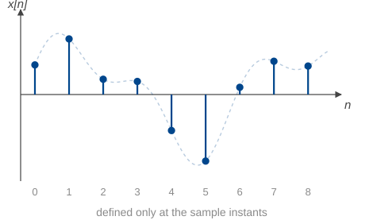

## Signals and systems

A **signal** is a function that carries information: a voltage on a wire, the price of a barrel of oil, the
brightness of a pixel, the pressure of the air in this room.

A **system** takes a signal in and puts a signal out: an amplifier, a filter, a circuit,
a trading algorithm, a lens.

## Course outline

::: {.blocks}
::: {.block}
[Foundations]{.bh}
[Weeks 1–3]{.wk}

- Signals, systems, differential equations, Euler's formula
- Signals as vectors, systems as maps
- LTI systems, impulse response, convolution
:::

::: {.block}
[Frequency domain]{.bh}
[Weeks 4–6]{.wk}

- Periodic signals and the Fourier series
- Aperiodic signals and the Fourier transform
- Frequency response
:::

::: {.block}
[Systems and Laplace]{.bh}
[Weeks 7–9]{.wk}

- System response and stability
- The Laplace transform
- System analysis with the Laplace transform
:::

::: {.block}
[Applications]{.bh}
[Weeks 10–13]{.wk}

- Filter design
- Signal modulation
- System identification
- Advanced topics
:::
:::

::: {.note}
Everything is a different way of looking at the same object: a linear,
time-invariant system.  Both mathematically elegant and **extremely useful**: the core of electrical engineering.
:::

## Classes

**Lecture** — two hours a week, Monday 15:00-17:00. Typeset notes go up a couple of days before.

**Tutorials** — two hours, Weeks 2--13. Ten tutorials (two weeks are labs).
This is where the quizzes happen.

**Labs** — two practicals on the TIMS hardware, in Weeks 6 and 8 for half the tutorial
groups and Weeks 7 and 9 for the other half. Attendance is mandatory.

::: {.note}
Times, rooms and which lab weeks apply to you are on your timetable.
There is no tutorial in Week 1.
:::

## Course materials

 Lectures, tutorials and lab instructions will be posted on the course website: [tchaffey.com/elec2302]{.navy}.

 Anything to do with assessments: **Canvas**.

 Discussion: Ed.

## Assessment

| Component | Weight | When |
|:---|---:|:---|
| Tutorial prework | 4% | Weekly, from Week 2 |
| Quiz 1 | 10% | Week 4 tutorial + two more attempts |
| Quiz 2 | 15% | Week 8 or 9 tutorial + two more attempts |
| Quiz 3 | 15% | Week 12 tutorial + one more attempt |
| Lab 1 milestones | 3% | In your lab |
| Lab 2 milestones | 3% | In your lab |
| Final exam | 50% | Formal exam period |
| Bonus extension quizzes | +2.5% each | after quiz 2 and quiz 3 if you have an HD |

## Prework

Prework is marked for a genuine attempt, not for being right: 0.5% each, capped at 4%.
That is eight of the ten tutorials, so [you can miss two without losing anything]{.navy}.

Prework must be [handwritten]{.navy}.  Take a photo before you hand it in.

## Quizzes {.smaller}

Three quizzes, each 30 minutes, in your tutorial.

::: {.note}
**You need 70% in each quiz to pass the unit.**
:::

- [More than one attempt]{.navy} at every quiz: three at Quizzes 1 and 2, two at Quiz 3.
- Each attempt is in a later tutorial, and your [best mark]{.navy} is the one that counts.
- The questions change between attempts but test the same material. You cannot look up last week's answers.

::: {.note}
The bar is high [because]{.navy} you get more than one go at it. Needing a second
attempt is normal!
:::

- An HD in Quiz 2 or Quiz 3 unlocks a Bonus Quiz, where you can earn up to 2.5% top up marks (per quiz).

## When your quizzes happen {.smaller}

Quizzes run in tutorials. [Your attempts are in your next tutorials,]{.navy} so if you have a lab, your quiz will be the week after.

::: {.duo}
::: {.col}
[If your labs are Weeks 6 and 8]{.bh}

- Quiz 1 — Weeks 4, 5, 7
- Quiz 2 — Weeks 9, 10, 11
- Quiz 3 — Weeks 12, 13
:::

::: {.col}
[If your labs are Weeks 7 and 9]{.bh}

- Quiz 1 — Weeks 4, 5, 6
- Quiz 2 — Weeks 8, 10, 11
- Quiz 3 — Weeks 12, 13
:::
:::

::: {.note}
Some groups sit a quiz a week before others. Different groups get [different versions]{.navy},
and every group gets the [same number of attempts]{.navy}, so nobody is advantaged by the
timetable. Your weeks are on your timetable.
:::

<!-- CHECK: attempt weeks derived from the lab pattern on the Classes slide (labs 6 & 8
     / 7 & 9, tutorials Weeks 2-13). Both groups get 3 + 3 + 2 attempts and Quiz 2's last
     attempt (Wk 11) clears Quiz 3's first (Wk 12). Confirm against the final timetable. -->

## What the quizzes look like

[On Canvas, locked-down browser]{.bh}

- Short numeric answers — calculations
- Multiple choice — concepts and reasoning


You get a [formula sheet]{.navy} and can use a calculator. The formula sheet is on the course website [tchaffey.com/elec2302]{.navy}.

<!-- CHECK: does the paper component get re-sat with the Canvas part, or is it sat once
     and carried forward? Slide is written to work either way; add a line if you want the
     rule stated up front. -->

## Tutorials and exam

In the tutorials, you will work through practice problems.  These are designed to develop and extend the concepts in the lectures and give you *practical experience* analysing signals and systems.

**The exam will be closely modelled on the tutorial problems**.

## Where to find help

**Me** — straight after this lecture, and in office hours (email me to make an appointment: thomas.chaffey@sydney.edu.au).

**Your tutors** — in tutorials and labs. They see your work every week and they are the
fastest route to an answer.

**Ed Discussion** — ask and answer!  Teaching staff will attempt to answer unanswered questions within a day.

**Canvas** — notes, prework, quiz details, everything administrative.

## Expectations{.smaller}

::: {.duo}
::: {.col}
[What you can expect of us]{.bh}

* Quiz and prework marks within one week
* Answering emails and Ed posts within two working days (aiming for one)
* Answering questions during tutorials, after lecture
* Clear guidelines for quizzes and the exam
:::

::: {.col}
[What we expect of you]{.bh}

* About **6hrs independent study** per week, as well as tutorial and lecture
* Attend your tutorials and labs
* Attempt prework before the tutorial
* Attend or read lecture before the tutorial
* Complete the tutorial problems after the tutorial
* Ask questions
* Have fun!
:::
:::

**Pass/credit standard:** able perform calculations and system analysis to a sufficient standard for third year courses.

**D/HD standard:** understand the underlying concepts and structures, perform analysis beyond the example problems.

# What is this course about?

## Signals and systems

A **signal** is a function that carries information: a voltage on a wire, the price of a barrel of oil, the
brightness of a pixel, the pressure of the air in this room.

A **system** takes a signal in and puts a signal out: an amplifier, a filter, a circuit,
a trading algorithm, a lens.

## Example 1: seeing through cloud

::: {.shot}

:::

::: {.credit}
Thin cloud removal from satellite imagery. Left of each pair: the observed scene.
Right: the recovered surface. The cloud is separated from the ground by filtering.

Lei, M., Li, H., Xu, L., &amp; Shen, H. (2025). Diffusion generation with homomorphic
filtering for remote sensing thin cloud removal. *Geo-Spatial Information Science*, 1–14.
:::

## Example 2: the price of oil

::: {.shot}

:::

::: {.credit}
West Texas Intermediate crude, April 2022 to July 2026. One price per trading day.
:::

## Example 3: algorithmic trading

::: {.shot}

:::

Knight Capital, 1 August 2012. A rogue trading system ran for 45 minutes and lost
[US\$440 million]{.out} (about \$10 million a minute).

::: {.credit}
Headline: BBC News, 11 August 2012.
:::

## Example 4: filtering sound {.smaller}

<iframe src="resonant-lowpass.html" class="widget-frame"></iframe>

A 100 Hz square wave through a resonant low-pass filter. Move the cutoff and listen to the
harmonics disappear one at a time.

## Example 5: positioning a silicon wafer {.smaller}

::: {.shot}

:::

A lithography machine prints circuit patterns onto a wafer that is being moved underneath
the optics. The stage has to follow its trajectory to within [nanometres]{.navy} while
accelerating hard to maximise throughput.

**Signals** — the measured stage position, and the torque commanded to the motors.
**System** — the wafer stage being positioned.

::: {.credit}
Cutaway of an extreme-ultraviolet lithography system. Image: ASML.
:::

## Example 6: the FFT is everywhere! {.smaller}

::: {.shot}

:::

Wi-Fi and 5G rely on specialised chips that compute the Fast Fourier Transform of every incoming and outgoing signal. 
In Wi-Fi, a 64-point transform runs every
4 µs: [a quarter of a million transforms a second]{.navy}.

::: {.credit}
LTE-FFT IP core, AMD. Waveform defined in IEEE Std 802.11a-1999 §17.3.5.9 and 3GPP TS 36.211 §6.12.
:::

## Example 7: convolution for machine learning {.smaller}

::: {.shot}
{width=50%}
:::
::: {.shot}

:::

A neural network built from memristor crossbars. The convolution (an operation we will learn in Week 3) is the foundation of Convolutional Neural Networks.  The figure shows an experimental design for computing the convolution in the array itself, by [Ohm's law and Kirchhoff's current law]{.navy}.
This is two orders of magnitude more energy-efficient than a GPU.

::: {.credit}
Yao, P., Wu, H., Gao, B., Tang, J., Zhang, Q., Zhang, W., Yang, J. J., &amp; Qian, H. (2020).
Fully hardware-implemented memristor convolutional neural network. *Nature*, 577, 641–646.
:::

## Types of signals {.smaller}

::: {.duo}
::: {.col}
A **continuous-time** signal has a value at every instant: the air pressure at your ear,
the voltage across a capacitor, the current in a circuit.

$$ x(t), \qquad t \in \mathbb{R} $$

{.diagram}
:::

::: {.col}
A **discrete-time** signal has a value only at particular instants: the closing price each
day, the samples in an audio file, the pixels in an image.

$$ x[n], \qquad n \in \mathbb{Z} $$

{.diagram}
:::
:::

::: {.note}
Of the examples so far: the sound and the wafer stage were continuous, the oil price and the
radio samples were discrete, and the satellite image was discrete in two spatial dimensions
rather than in time.
:::

## What will we learn in this course?{.smaller}

**Continuous-time signals** and **linear, time-invariant systems**.

Two views of the same system, and the translation between them:

- **Time domain** — differential equations, impulse response, convolution.
- **Frequency domain** — Fourier series, Fourier transform, Laplace transform.

::: {.note}
Linear and time-invariant are strong assumptions. They are also the assumptions that make
the problem solvable, and they hold well enough to have built most of the twentieth century.
:::

## Why is this useful?

These are the foundations of:

::: {.blocks}
::: {.block}
[Systems]{.bh}

- Control
- Stability analysis
- System identification
:::

::: {.block}
[Communications]{.bh}

- Modulation
- Filtering
- Sampling
:::

::: {.block}
[Devices]{.bh}

- Analogue electronics
- Photonics
- Power systems
:::

::: {.block}
[Computation]{.bh}

- Signal processing
- Convolutional neural networks
- Imaging
:::
:::

## Where we start

::: {.handover}
Signals and systems sits at the intersection of **differential equations**,
**linear algebra**, **complex numbers** and **trigonometry**.

Rest of today's lecture: the exponential function, Euler's formula,
and the complex plane.
:::

## Euler's formula {.smaller}

$$ e^{j\theta} = \cos\theta + j\sin\theta $$

::: {style="display:flex;justify-content:center"}
```{=html}
<div id="w-euler" class="widget"></div>
```
:::

## Adding sinusoids {.smaller}

$$ 3\,e^{j\omega t} + 4j\,e^{j\omega t} = 5\,e^{j0.927}e^{j\omega t} $$

::: {style="display:flex;justify-content:center"}
::: {style="transform-origin:top center;height:490px"}
```{=html}
<div id="w-sum" class="widget"></div>
```
:::
:::

```{=html}
<script src="phasor-widgets.js"></script>
```
