::: {.content-visible when-format="html"}
::: {.format-links}
[Other formats:]{.label}
```{=html}
<a href="notes.pdf" title="Week 3 lecture notes as a PDF"
   data-goatcounter-click="pdf-week3"
   data-goatcounter-title="Week 3 notes PDF opened">&#128196;&nbsp;PDF</a>
```
:::
:::

::: {.content-visible when-format="pdf"}
The figures below are snapshots of interactive widgets. The live versions, where
you can move the sliders yourself, are at
[tchaffey.com/elec2302](https://tchaffey.com/elec2302/?ref=notes-pdf-week3).
:::

<!-- CHECK: the revised page 1 heads the lecture "linear, time-invariant systems", so I
     have used that as the subtitle. The previous version, and the Week 3 tutorial sheet,
     use "LTI systems, impulse response and convolution". -->

## Goals

① Convolution: calculate the output of an LTI system by breaking the input into pieces.

② Impulse response: complete representation of an LTI system.

③ LTI systems preserve frequency.

④ ODE descriptions of LTI systems.

⑤ Interconnections of systems.

## Recap

Linear $\iff$ superposition

::: {style="text-align:center"}
{width=560}
:::

::: {style="text-align:center"}
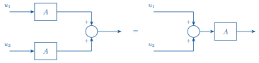{width=560}
:::

add/scale input $\iff$ add/scale output

## ① Convolution

If we apply regular impulses to a system, what do we get at the output?

::: {style="text-align:center"}
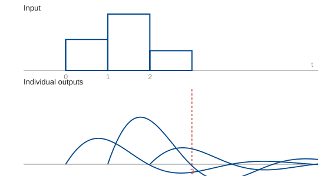{width=520}
:::

What do we have at time $3$?

$h$ started at $\tau = 2$ and gone $1$ time step: $\;\overbrace{h(t-2)}^{h(1)}\,u(2)\;$

$h$ started at $\tau = 1$ and gone $2$ time steps: $\;\overbrace{h(t-1)}^{h(2)}\,u(1)\;$

$h$ started at $\tau = 0$ and gone $3$ time steps: $\;\overbrace{h(t-0)}^{h(3)}\,u(0)\;$

So for fixed $t$: flip $h$ and shift by $t$, then for each $\tau \in [0, t]$, multiply with $u(\tau)$ and add to total.

::: {style="text-align:center"}
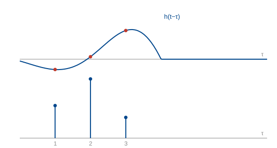{width=520}
:::


::: {.content-visible when-format="pdf"}
{#fig-comb width=100%}
:::

This gives the output to a sum of impulses.  It turns out we can approximate any input as such a sum.

::: {.content-visible when-format="html"}
```{=html}
<div id="w-comb" class="widget"></div>
```
:::

::: {style="text-align:center"}
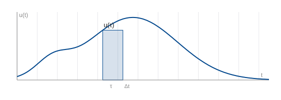{width=520}
:::

Area of the shaded rectangle: $u(\tau)\,\Delta t.$

We can represent this area by an impulse, $\delta(t-\tau)\,u(\tau)\,\Delta t.$

These impulses for each rectangle approximate $u(t)$, just like a Riemann integral:

$$ u(t) \approx \sum_{k=-\infty}^{\infty} \delta(t-k\Delta t)\,u(k\Delta t)\,\Delta t \qquad(1) $$

The corresponding output is a sum of delayed **impulse responses** that approximates the output of the system:

$$ y(t) \approx \sum_{k=-\infty}^{\infty} h(t-k\Delta t)\,u(k\Delta t)\,\Delta t. \qquad(2) $$

What happens to (1) in the limit $\Delta t \to 0$?

$$ \sum_{k=-\infty}^{\infty} \delta(t-k\Delta t)\,u(k\Delta t)\,\Delta t
\;\longrightarrow\; \int_{-\infty}^{\infty}\! \delta(t-\tau)\,u(\tau)\,\mathrm{d}\tau $$

with $k\Delta t \to \tau$ and $\Delta t \to \mathrm{d}\tau$. So we have

$$ \boxed{\,u(t) = \int_{-\infty}^{\infty}\! \delta(t-\tau)\,u(\tau)\,\mathrm{d}\tau\,} $$

This is the **sifting property**! Read backwards, it says that the signal $u(t)$ is equal to an integral of impulses with amplitude $u(\tau)\,\mathrm{d}\tau$.

What about (2) in the limit $\Delta t \to 0$?

$$ \sum_{k=-\infty}^{\infty} h(t-k\Delta t)\,u(k\Delta t)\,\Delta t
\;\longrightarrow\; \int_{-\infty}^{\infty}\! h(t-\tau)\,u(\tau)\,\mathrm{d}\tau. $$

So we have:

$$ \boxed{\,y(t) = \int_{-\infty}^{\infty}\! h(t-\tau)\,u(\tau)\,\mathrm{d}\tau\,} $$

The response to **any input** $u(t)$ is **determined by the impulse response**! We will look more closely at how to calculate the impulse response soon, but first let's understand the expression above.

## Convolution: definition and properties

$$ \boxed{\;\text{The operation}\quad h * u := \int_{-\infty}^{\infty}\! h(t-\tau)\,u(\tau)\,\mathrm{d}\tau\;} $$

is called **convolution**.

Basic properties of convolution:

**1.** $h * u = u * h$ (commutativity)

Proof:

$$ h * u = \int_{-\infty}^{\infty}\! h(t-\tau)\,u(\tau)\,\mathrm{d}\tau. $$

Let $T = t - \tau$. Then $\tau = t - T$ and $\mathrm{d}T = -\mathrm{d}\tau.$

$$
\begin{aligned}
&= -\int_{\infty}^{-\infty}\! h(T)\,u(t-T)\,\mathrm{d}T \\[2pt]
&= \int_{-\infty}^{\infty}\! u(t-T)\,h(T)\,\mathrm{d}T \;=\; u * h.
\end{aligned}
$$

**2.** $(h_1 + h_2) * u = h_1 * u + h_2 * u$ (additivity).

**3.** $h_1 * (h_2 * h_3) = (h_1 * h_2) * h_3$ (associativity).

**4.** $\displaystyle (u * \delta)(t) = \int_{-\infty}^{\infty}\! u(t-\tau)\,\delta(\tau)\,\mathrm{d}\tau = u(t).$

**5.** $\displaystyle (u * \delta(t-T)) = \int_{-\infty}^{\infty}\! u(t-\tau)\,\delta(\tau-T)\,\mathrm{d}\tau = u(t-T). \qquad = \text{pure delay!}$

**6.**

$$
\begin{aligned}
(f * g)' &= \frac{\mathrm{d}}{\mathrm{d}t}\int_{-\infty}^{\infty}\! f(t-\tau)\,g(\tau)\,\mathrm{d}\tau \\[2pt]
         &= \int_{-\infty}^{\infty}\! \frac{\mathrm{d}}{\mathrm{d}t}f(t-\tau)\,g(\tau)\,\mathrm{d}\tau \\[2pt]
         &= f' * g.
\end{aligned}
$$

But also: $(f * g)' = (g * f)' = g' * f.$

So

$$ (f * g)' = f' * g = g' * f $$

### Example: a pulse convolved with itself

Example: plot $(2p_1 * 2p_1)(t)$

$$ \int_{-\infty}^{\infty}\! 2p_1(t-\tau)\,2p_1(\tau)\,\mathrm{d}\tau $$

The value of $(2p_1 * 2p_1)(t)$ is the area under the product: the heights multiply, so it is $2 \times 2$ times the width of the overlap.

::: {.content-visible when-format="html"}
```{=html}
<div id="w-conv" class="widget"></div>
```
:::

::: {.content-visible when-format="pdf"}
{#fig-conv width=70%}
:::

### Example: radar

```{=html}
<div style="text-align:center">
<svg viewBox="0 0 540 200" width="520" xmlns="http://www.w3.org/2000/svg" role="img"
     aria-label="A train of transmitted pulses on the left; on the right a radar mast with
                 three rays out to three objects at ranges r1, r2 and r3.">
  <defs>
    <marker id="ahRD" viewBox="0 0 10 10" refX="9" refY="5" markerWidth="7" markerHeight="7"
            orient="auto-start-reverse">
      <path d="M 0 0 L 10 5 L 0 10 z" fill="#00468C"/>
    </marker>
  </defs>
  <line x1="20" y1="120" x2="215" y2="120" stroke="#00468C" stroke-width="1.8"/>
  <g stroke="#00468C" stroke-width="1.6" marker-end="url(#ahRD)">
    <line x1="45" y1="120" x2="45" y2="60"/>
    <line x1="95" y1="120" x2="95" y2="60"/>
    <line x1="145" y1="120" x2="145" y2="60"/>
    <line x1="195" y1="120" x2="195" y2="60"/>
  </g>
  <g stroke="#00468C" fill="none" stroke-width="1.2">
    <path d="M 300 175 L 320 95 L 340 175"/>
    <line x1="296" y1="175" x2="344" y2="175"/>
    <line x1="306" y1="151" x2="334" y2="151"/>
    <line x1="311" y1="131" x2="329" y2="131"/>
    <line x1="304" y1="163" x2="331" y2="139"/>
    <line x1="309" y1="139" x2="336" y2="163"/>
    <path d="M 320 95 A 20 20 0 0 1 320 63"/>
  </g>
  <g stroke="#00468C" fill="none" stroke-width="1.2">
    <line x1="320" y1="79" x2="470" y2="30"/>
    <line x1="320" y1="79" x2="480" y2="62"/>
    <line x1="320" y1="79" x2="472" y2="96"/>
  </g>
  <g fill="#00468C">
    <circle cx="474" cy="28" r="4"/>
    <circle cx="484" cy="61" r="4"/>
    <circle cx="476" cy="97" r="4"/>
  </g>
  <text x="386" y="49" font-family="Arial" font-size="13" fill="#00468C" font-style="italic">r&#8321;</text>
  <text x="398" y="66" font-family="Arial" font-size="13" fill="#00468C" font-style="italic">r&#8322;</text>
  <text x="390" y="99" font-family="Arial" font-size="13" fill="#00468C" font-style="italic">r&#8323;</text>
</svg>
</div>
```

For each object, the pulse is delayed by $t_{d_i} = \dfrac{2r_i}{c}.$

This can be interpreted as a **system impulse response**.

input: $\delta(t)$

system: the scene

output: $\displaystyle \sum_i \delta(t - t_{d_i}).$

$\hookrightarrow$ output is a sum of delayed versions of the input.

What system is this the impulse response of?

$$ \sum_i D_{t_{d_i}} \qquad \text{: a sum of delays, one for each object.} $$

What is the response if we inject a sinusoid:

Intuitively: $u(t) = \cos(\omega t)$, $\;y(t) = \sum_i \cos(\omega t - \omega t_{d_i}).$

Let's check our intuition with what we just learnt:

$$
\begin{aligned}
y(t) &= u(t) * h(t) \\[2pt]
     &= u(t) * \sum_i \delta(t - t_{d_i}) \\[2pt]
     &= \sum_i \int_{-\infty}^{\infty}\! u(t-\tau)\,\delta(\tau - t_{d_i})\,\mathrm{d}\tau \\[2pt]
     &= \sum_i u(t - t_{d_i}) \qquad \text{(sifting property)} \\[2pt]
     &= \sum_i \cos(\omega t - \omega t_{d_i}).
\end{aligned}
$$

## ② The impulse response of circuits

Now let's look at the impulse response of circuits.

::: {.columns}
::: {.column width="49%"}
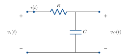{width=100%}

In the RC circuit, a change in $v_i$ causes **gradual** change in $v_o$.
:::
::: {.column width="2%"}
:::
::: {.column width="49%"}
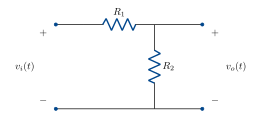{width=100%}

In the voltage divider, a change in $v_i$ causes **instantaneous** change in $v_o$.
:::
:::

$\hookrightarrow$ capacitor has memory:

the charge stored on its plates carries a memory of the current.

The impulse is a fictitious signal that deposits charge on the capacitor instantaneously:

$$ q_c = \int i_c(t)\,\mathrm{d}t $$

So if $i_c(t) = \delta(t)$, $\;q_c(0) = \displaystyle\int_{0^-}^{0^+}\!\delta(t)\,\mathrm{d}t = 1.$

This means an impulse response (inhomogeneous ODE) is equivalent to an initial condition response (homogeneous ODE).

This holds generally for LTI systems. Let's see how on the RC circuit above.

$$ v_i(t) = v_R + v_C $$

$$ v_R = iR $$

$$ i = \frac{\mathrm{d}}{\mathrm{d}t}C v_C. $$

So

$$ v_i(t) = v_C(t) + \frac{\mathrm{d}}{\mathrm{d}t}RC v_C(t). $$

Now let $v_i(t) = \delta(t)$.

$$ \delta(t) = v_C(t) + \frac{\mathrm{d}}{\mathrm{d}t}RC v_C(t). $$

Integrate both sides on $[0^-, 0^+]$.

$$ \int_{0^-}^{0^+}\!\delta(t)\,\mathrm{d}t = \underbrace{\int_{0^-}^{0^+}\! v_C(t)\,\mathrm{d}t}_{=\,0} + RC\,v(0) $$

$$ 1 = RC\,v(0) $$

$$ v(0) = \frac{1}{RC}. $$

::: {.note}
Impulse at $t=0$ deposits an **initial condition**.
:::

We can use this to calculate the impulse response, by solving

$$ \frac{\mathrm{d}}{\mathrm{d}t}RC v_C(t) + v_C(t) = 0, \qquad v_C(0) = \frac{1}{RC} \qquad(3) $$

Let $v_C(t) = \alpha e^{-\beta t}.$

$$ \frac{\mathrm{d}}{\mathrm{d}t}v_C = -\beta\alpha e^{-\beta t}. $$

Sub in (3):

$$ -RC\beta\alpha e^{-\beta t} = -\alpha e^{-\beta t} $$

$$ RC\beta = 1 \iff \beta = \frac{1}{RC}. $$

Use the initial condition to find $\alpha$:

$$ v_C(0) = \alpha e^{0} = \frac{1}{RC}. $$

So the impulse response is

$$ v_C(t) = \frac{1}{RC}\,e^{-\frac{1}{RC}t} =: h(t). $$

<!-- CHECK: the exponent in the source reads e^{-(1/C)t}; with beta = 1/RC from the line
     above it should be e^{-(1/RC)t}, which is what I have used. -->

$h(t)$ is the usual notation we'll use for impulse response.

## ④ ODE descriptions of LTI systems

We can extend this result into a general principle for $n$th order differential equations:

$$ a_n y^{(n)}(t) + a_{n-1}y^{(n-1)}(t) + \cdots + a_0 y(t) = \delta(t) $$

$$ y^{(n-1)}(0) = y^{(n-2)}(0) = \cdots = y(0) = 0. $$

Integrate both sides over $0_-$ to $0_+$. Following the same intuition, every derivative lower than $y^{(n)}$ has $0$ area over $0_-$ to $0_+$, so we have

$$ \int_{0_-}^{0_+}\! a_n y^{(n)}(t)\,\mathrm{d}t = 1 $$

$$ y^{(n-1)}(0) = \frac{1}{a_n} $$

If we also allow derivatives of the input:

$$
\begin{aligned}
&a_n y^{(n)}(t) + a_{n-1}y^{(n-1)}(t) + \cdots + a_0 y(t) \\[2pt]
&\qquad = b_m u^{(m)}(t) + b_{m-1}u^{(m-1)}(t) + \cdots + b_0 u(t)
\end{aligned}
$$

with given initial conditions $y^{(n-1)}(0), y^{(n-2)}(0), \dots, y(0)$, we have a description for a large class of useful systems, including all of the circuits we've seen so far.

* $n$ is called the **order** of the system,
* the $a_i$ and $b_i$ are called the **coefficients** of the system,
* such systems are always **time-invariant**,
* if the initial conditions are all $0$, the system is **linear**,
* this gives an implicit description of the map from $u$ to $y$. In weeks 5 &amp; 6 we'll develop an explicit description.

## ③ LTI systems and sinusoids

Back to our RC circuit. Let's plug in a complex sinusoidal voltage and see what happens.

$$ v_i(t) = v_C(t) + \frac{\mathrm{d}}{\mathrm{d}t}RC v_C(t). $$

Let $v_i(t) = e^{j\omega t} = \cos(\omega t) + j\sin(\omega t).$

Guess a solution $v_C(t) = G e^{j\omega t}$ for some $G \in \mathbb{C}$ — a sinusoid of the same frequency.

$$ e^{j\omega t} = G e^{j\omega t} + \frac{\mathrm{d}}{\mathrm{d}t}RCG e^{j\omega t} $$

$$ e^{j\omega t} = G e^{j\omega t} + j\omega RCG e^{j\omega t} $$

$$ 1 = G + j\omega RCG \qquad (e^{j\omega t} \neq 0) $$

$$ G(j\omega) = \frac{1}{1 + j\omega RC}. $$

::: {.note}
Why is $Ge^{j\omega t}$ always such a good guess?
:::

<!-- CHECK: the circuit redrawn beside this calculation appears to label the shunt element
     L, but the equation above it is the RC circuit. I have kept the RC circuit. -->

Consider an arbitrary LTI system mapping $u$ to $y$.

Let $u(t) = e^{j\omega t} = \cos(\omega t) + j\sin(\omega t).$

Time invariance: $u(t-\tau) \longmapsto y(t-\tau).$

For this input,

$$
\begin{aligned}
u(t-\tau) &= e^{j\omega(t-\tau)} = e^{j\omega t}e^{-j\omega\tau} \\[2pt]
          &= e^{-j\omega\tau}u(t).
\end{aligned}
$$

This is the input $u$ scaled by $e^{-j\omega\tau}$.

By linearity, $y(t-\tau) = e^{-j\omega\tau}y(t).$

Set $t=0$ and relabel $-\tau = t$, then

$$ y(t) = e^{j\omega t}y(0), $$

where $y(0)$ is $G(j\omega)$ in the example above.

::: {.note}
LTI systems always map a sinusoid to a sinusoid of the same frequency.
:::

Let's think about this in terms of our matrix $\longleftrightarrow$ system analogy.

| matrix | LTI system |
| --- | --- |
| $y = Au$ | $y(t) = G(u(t))$ |
| If $u$ is an eigenvector, $y = Au = \lambda u$ | If $u = e^{j\omega t}$, $y = G(j\omega)\,e^{j\omega t}$ |
| $A$ scales $u$ to get $y$. | $G$ scales $u$ to get $y$. |
| | $e^{j\omega t}$ is an eigenvector! |

Matrices are hard in general, but diagonal matrices are easy, they simply scale each entry of the vector.
How do we diagonalise a matrix? We find a basis of eigenvectors.

Over the last three weeks, we've seen that time domain signals &amp; systems are hard to analyse.
We've just discovered that the eigenvectors of an LTI system are sinusoids. Can we use this to somehow "diagonalise" the system and make the analysis less difficult, the same as we would do for a matrix?

YES! This is what the Fourier Transform does. We will build this over the next three weeks.

## ⑤ Block diagrams and interconnections

Block diagrams or signal flow diagrams describe the exchange of signals between systems.

::: {.columns}
::: {.column width="55%"}
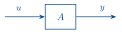{width=260}
:::
::: {.column width="45%"}
System $A$ with input $u$ and output $y$.
:::
:::

::: {.columns}
::: {.column width="55%"}
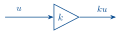{width=260}
:::
::: {.column width="45%"}
A static gain $k$.
:::
:::

::: {.columns}
::: {.column width="55%"}
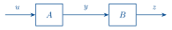{width=320}
:::
::: {.column width="45%"}
A cascade interconnection.
:::
:::

::: {.columns}
::: {.column width="55%"}
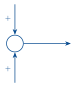{width=120}
:::
::: {.column width="45%"}
The sum of two signals.
:::
:::

::: {.columns}
::: {.column width="55%"}
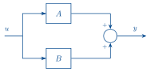{width=320}
:::
::: {.column width="45%"}
A parallel interconnection.
:::
:::

::: {.columns}
::: {.column width="55%"}
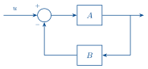{width=320}
:::
::: {.column width="45%"}
A negative feedback interconnection (the subject of control systems).
:::
:::

## Extra example: impulse response of an RLC circuit

::: {style="text-align:center"}
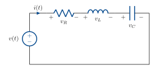{width=540}
:::

Let's consider $v_C$ to be the output.

$$ v(t) = v_R + v_L + v_C \qquad \text{(KVL)} $$

$$ i = C\frac{\mathrm{d}}{\mathrm{d}t}v_C $$

$$ v_L = L\frac{\mathrm{d}}{\mathrm{d}t}i $$

$$ v_R = Ri $$

Combining, KVL becomes:

$$ v(t) = L\frac{\mathrm{d}}{\mathrm{d}t}i + Ri + v_C \qquad(4) $$

Or

$$ v(t) = LC\frac{\mathrm{d}^2}{\mathrm{d}t^2}v_C(t) + RC\frac{\mathrm{d}}{\mathrm{d}t}v_C(t) + v_C. $$

Now assume the circuit is at rest and we apply an impulse voltage.

Imagine what $v(t) = \delta(t)$ does to the circuit around $t=0$.

Integrate (4):

$$
\int_{0^-}^{0^+}\!\delta(t)\,\mathrm{d}t
= \int_{0^-}^{0^+}\! L\frac{\mathrm{d}}{\mathrm{d}t}i(t) + \underbrace{Ri(t) + v_C(t)}_{\text{assume finite}}\,\mathrm{d}t
$$

The underbraced terms give $0$, as we are integrating over an infinitesimal interval. So

$$ 1 = Li(0) $$

$$ i(0) = \frac{1}{L}. $$

Now,

$$ v_C(0) = \frac{1}{C}\int_{0^-}^{0^+}\! i(t)\,\mathrm{d}t = 0. $$

Conclusion: the impulse at $0$ deposits an **initial condition** on the inductor: the 2nd highest derivative of $v_C$.

We can now solve the impulse response of the circuit as an initial condition response:

$$
\frac{\mathrm{d}^2}{\mathrm{d}t^2}v_C(t)
+ \underbrace{\frac{R}{L}}_{2\zeta\omega_n}\frac{\mathrm{d}}{\mathrm{d}t}v_C(t)
+ \underbrace{\frac{1}{LC}}_{\omega_n^2}v_C(t) = 0 \qquad(5)
$$

with $v_C(0) = 0,$

$$ v_C'(0) = \frac{1}{C}i(0) = \frac{1}{LC}. $$

We suspect the solution will be some kind of exponential/sinusoid combo, so let's guess a solution

$$ e^{st} \qquad \text{for some } s \in \mathbb{C}. $$

Substituting in (5):

$$ s^2 e^{st} + 2\zeta\omega_n s\, e^{st} + \omega_n^2 e^{st} = 0 $$

$e^{st} \neq 0$, so

$$ s^2 + 2\zeta\omega_n s + \omega_n^2 = 0 \qquad(6) $$

$$
\begin{aligned}
s &= \frac{-2\zeta\omega_n \pm \sqrt{4\zeta^2\omega_n^2 - 4\omega_n^2}}{2} \\[2pt]
  &= -\zeta\omega_n \pm \omega_n\sqrt{\zeta^2 - 1}.
\end{aligned}
$$

The roots of (6) are called the **poles** of the system (recall pole position &amp; behaviour from week 1).

Suppose $R = 6\,\Omega$, $L = 1\,\mathrm{H}$, $C = 40\,\mathrm{mF}$.

Then $s = -3 \pm 4j.$

so the response is

$$ v_C(t) = A e^{(-3+4j)t} + B e^{(-3-4j)t}. $$

$v_C(0) = 0$, so $A + B = 0. \quad\Rightarrow\quad B = -A$

$v_C'(0) = \dfrac{1}{LC}$, so

$$ (-3+4j)A - (-3-4j)A = \frac{1}{LC} $$

$$ A = \frac{1}{8j\,LC} $$

$$ = -3.125j $$

so we have

$$
\begin{aligned}
v_C(t) &= A e^{(-3+4j)t} + \bar{A}\, e^{(-3-4j)t} \qquad\text{(complex conjugates!)} \\[2pt]
       &= 2\operatorname{Re}\!\big(A e^{(-3+4j)t}\big) \\[2pt]
       &= 6.25\, e^{-3t}\sin(4t)\,H(t)
\end{aligned}
$$

$H(t)$ encodes that the signal is $0$ before $t=0$.

```{=html}
<script src="convolution-widgets.js"></script>
```
