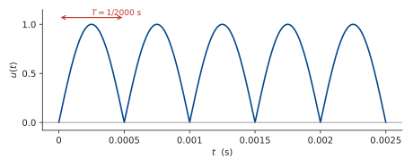
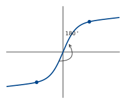
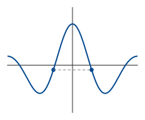
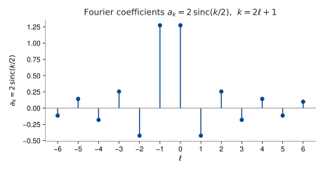
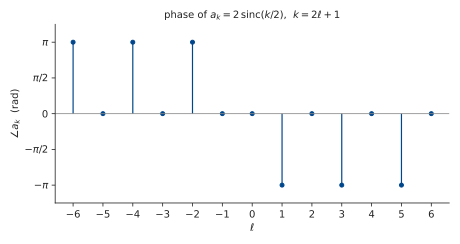

::: {.content-visible when-format="html"}
::: {.format-links}
[Other formats:]{.label}
```{=html}
<a href="notes.pdf" title="Week 4 lecture notes as a PDF"
   data-goatcounter-click="pdf-week4"
   data-goatcounter-title="Week 4 notes PDF opened">&#128196;&nbsp;PDF</a>
```
:::
:::

## From impulses to sinusoids

This week we start to develop frequency-domain tools.

So far, we have seen that any (integrable) signal can be represented as an integral ("sum") of impulses. This week we develop an alternative representation for <u>periodic</u> signals, by changing the basis signals from impulses to sinusoids. This is the <u>Fourier series</u>.

<!-- Demo: impulse response of a nonlinear system. -->

**Recap.** If a system is LTI, it preserves the frequency of a sinusoidal input:

$$ u = e^{\,j\omega t} \;\longmapsto\; G(j\omega)\,e^{\,j\omega t}, \qquad G(j\omega) \in \mathbb{C}. $$

In other words, $e^{\,j\omega t}$ is an eigenvector of the system. If we can express any $u$ in this basis, as a sum of sinusoids, this will "diagonalise the system" and "simplify analysis", in ways that we will soon see.

This also gives a quick test of whether a system is LTI: inject a sinusoid and see what comes out at the output.

## Approximating a periodic signal

A signal $u(t)$
is $T$-periodic if $u(t)=u(t−T)$.
The fundamental frequency of $u$ is the frequency corresponding to smallest $T$
such that $u(t)$
is $T$-periodic.  For example, $sin(t)$
is $2\pi$
periodic, but also $4\pi$
periodic, $6\pi$ periodic, etc.  The fundamental frequency is the frequency corresponding to period $2\pi$, that is, $1$ rad/s.

For the sum of two signals to be $T$-periodic, the individual signals must both be $T$-periodic, so we want to find the minimum common period of the two sinusoids.

Let $u(t)$ be an arbitrary periodic signal with fundamental frequency $\frac{2\pi}{T}$.

$$ \phi(t) := e^{\,j\left(\frac{2\pi}{T}t\right)} \quad\text{also periodic on } [0,T]. \qquad \text{Let } \tfrac{2\pi}{T} =: \omega. $$

How well can we approximate $u(t)$ by scaling &amp; rotating $e^{j\omega t}$?

We already have a measure of the size of a periodic signal:

$$ P(u) := \frac{1}{T}\int_0^T |u(t)|^2\,\mathrm{d}t = \langle u, u\rangle_P = \|u\|_P^2 \qquad (\text{see Lecture 2}). $$

Multiplying $\phi$ by $c \in \mathbb{C}$ gives us a <u>scaling and rotation</u> of $\phi$:

$$ c = a\,e^{\,j\vartheta} \;(\text{polar form}) \quad\text{so}\quad c\phi = a\,e^{\,j(\omega t + \vartheta)}. $$

Here $a$ is the <span class="out">scale</span>, and the <span class="out">rotation $=$ phase shift</span>.

Let's minimise $J(c) = \|u - c\phi\|_P^2$ over $c \in \mathbb{C}$, then $u \approx c\phi$.

$$
\begin{aligned}
J(c) &= \langle u - c\phi,\; u - c\phi\rangle_P \\[2pt]
&= \langle u, u\rangle_P - \langle u, c\phi\rangle_P - \langle c\phi, u\rangle_P + \langle c\phi, c\phi\rangle_P \\[2pt]
&= \|u\|_P^2 - \bar{c}\,\langle u,\phi\rangle_P - c\,\overline{\langle u,\phi\rangle}_P + |c|^2\,\|\phi\|_P^2 . \qquad(1)
\end{aligned}
$$

We can simplify $\|\phi\|_P^2$:

$$
\|\phi\|_P^2 = \frac{1}{T}\int_0^T e^{\,j\omega t}\,e^{-j\omega t}\,\mathrm{d}t
= \frac{1}{T}\int_0^T 1\,\mathrm{d}t = 1 .
$$

Let $\gamma := \langle u,\phi\rangle$. Then we can write $(1)$ as

$$ J(c) = \|u\|_P^2 - \bar{c}\gamma - c\bar{\gamma} + |c|^2 . $$

Now notice that

$$
\begin{aligned}
|c-\gamma|^2 &= (c-\gamma)\overline{(c-\gamma)} \\[2pt]
&= |c|^2 - \gamma\bar{c} - c\bar{\gamma} + |\gamma|^2 .
\end{aligned}
$$

So

$$ J(c) = \|u\|_P^2 + |c-\gamma|^2 - |\gamma|^2 . $$

All terms are positive. This is minimised when $|c-\gamma|^2 = 0$, that is,

$$ \boxed{\,c = \langle u,\phi\rangle_P = \frac{1}{T}\int_0^T u(t)\,e^{-j\omega t}\,\mathrm{d}t\,} $$

The least-squares approximation of $u(t)$ by $\phi(t)$ is therefore

$$ \boxed{\,c\phi = \frac{\langle u,\phi\rangle_P}{\|\phi\|_P^2}\,\phi\,} $$

This is <u>the projection of $u$ onto $\phi$</u>.

::: {style="text-align:center"}
{width=680}
:::

This procedure is exactly the same for $\phi_k = e^{\,jk\omega t}$ for any $k \in \mathbb{Z}$, so we define

$$ \boxed{\,c_k = \langle u,\phi_k\rangle_P = \frac{1}{T}\int_0^T u(t)\,e^{-jk\omega t}\,\mathrm{d}t\,} $$

These are the <u>complex Fourier coefficients</u>.

## The Fourier series

Each coefficient gives a least-squares approximation of $u(t)$ by $\phi_k(t)$, calculated as

$$ u(t) \approx c_k \phi_k = \frac{\langle u,\phi_k\rangle_P}{\|\phi_k\|_P^2}\,\phi_k, $$

the projection of $u$ onto $\phi_k$.

It turns out that the sum of all these approximations is an <u>exact</u> representation of $u(t)$ (provided it is sufficiently well-behaved):

$$ \boxed{\,u = \sum_{k=-\infty}^{\infty} c_k \phi_k = \sum_{k=-\infty}^{\infty} \langle u,\phi_k\rangle_P\,\phi_k, \qquad \phi_k(t) = e^{\,jk\omega t}\,} $$

This is the <u>Fourier series</u> of $u$. It also turns out that each $c_k$ is independent, as $\phi_k$ are orthogonal, so the finite sum $\displaystyle\sum_{k=-n}^{n} \langle u,\phi_k\rangle_P\,\phi_k$ is a least-squares approximation of $u$ by $\{\phi_k\}_{k=-n,\dots,n}$. See the extension section below for the full details.

For $k = 0$, we have

$$
\begin{aligned}
c_0 = \langle u,\phi_0\rangle &= \frac{1}{T}\int_0^T u\,e^{0}\,\mathrm{d}t \\[2pt]
&= \frac{1}{T}\int_0^T u(t)\,\mathrm{d}t . \qquad \text{Average value of } u = \text{DC offset.}
\end{aligned}
$$

::: {.extension}
[Extension material]{.extension-label}

### Why are the $c_k$ independent?

First, let's calculate

$$
\begin{aligned}
\langle \phi_k, \phi_\ell\rangle &= \frac{1}{T}\int_0^T e^{\,jk\omega t}\,e^{-j\ell\omega t}\,\mathrm{d}t \\[2pt]
&= \frac{1}{T}\int_0^T e^{\,+j(k-\ell)\omega t}\,\mathrm{d}t \\[2pt]
&= 1 \quad \text{if } k = \ell \quad\text{or} \\[6pt]
&= \left[\frac{1}{+j(k-\ell)\omega}\,e^{\,+j(k-\ell)\omega t}\right]_0^{T} \\[6pt]
&= 0 \quad \text{as } e^{\,+j(k-\ell)\omega t} \text{ is } T\text{-periodic.}
\end{aligned}
$$

This means the $\phi_k$ are <u>orthogonal</u>.

Now let's minimise $\left\|u - \sum_k c_k \phi_k\right\|_P^2$.

$$
\begin{aligned}
\left\|u - \sum_k c_k \phi_k\right\|_P^2
&= \left\langle u - \sum_k c_k \phi_k,\; u - \sum_k c_k \phi_k\right\rangle_P \\[6pt]
&= \|u\|_P^2 + \left\langle u,\, -\sum_k c_k \phi_k\right\rangle + \left\langle -\sum_k c_k \phi_k,\, u\right\rangle \\&+ \left\langle \sum_k c_k \phi_k,\, \sum_k c_k \phi_k\right\rangle \\[6pt]
&= \|u\|_P^2 - \sum_k \bar{c}_k \underbrace{\langle u,\phi_k\rangle}_{:=\,\gamma_k} - \sum_k c_k \overline{\langle u,\phi_k\rangle} + \underbrace{\sum_k \sum_\ell c_k \bar{c}_\ell \langle \phi_k,\phi_\ell\rangle}_{=\,0 \text{ for } k \neq \ell} \\[6pt]
&= \|u\|_P^2 - \sum_k \left(\bar{c}_k \gamma_k + c_k \bar{\gamma}_k\right) + \sum_k c_k \bar{c}_k \langle \phi_k,\phi_k\rangle .
\end{aligned}
$$

Following the same completion of squares argument as before, we have

$$ = \|u\|_P^2 + \sum_k |c_k - \gamma_k|^2 - \sum_k |\gamma_k|^2 . $$

This is minimised when $c_k = \gamma_k$ for all $k$. These are the Fourier coefficients we derived earlier with individual minimisations!

:::

If $u(t)$ is real, its Fourier series must be real:

$$ \operatorname{Im}\!\left(\sum_k c_k \phi_k\right) = 0. $$

This is achieved if

$$
\begin{aligned}
c_k \phi_k &= \overline{c_{-k}\,\phi_{-k}} \\[2pt]
&= \overline{c_{-k}}\,\phi_k .
\end{aligned}
$$

So $c_k = \overline{c_{-k}}$. In particular, $c_0 = \overline{c_0}$, so $c_0$ is real.

## The sine–cosine form for a real signal

In the real case, we can also derive a sin/cosine form of the Fourier series.

$$ \frac{e^{\,j\omega t} + e^{-j\omega t}}{2} = \cos\omega t, \qquad \frac{e^{\,j\omega t} - e^{-j\omega t}}{2j} = \sin\omega t. $$

Let $c_k = \tfrac{1}{2}(a_k - j b_k)$, $k \geq 0$. Then

$$
\begin{aligned}
c_k e^{\,jk\omega t} + c_{-k} e^{-jk\omega t}
&= c_k e^{\,jk\omega t} + \bar{c}_k e^{-jk\omega t} \\[2pt]
&= \tfrac{1}{2}(a_k - j b_k)\big(\cos(k\omega t) + j\sin(k\omega t)\big) + \tfrac{1}{2}(a_k + j b_k)\big(\cos(k\omega t) - j\sin(k\omega t)\big) \\[2pt]
&= a_k \cos(k\omega t) + b_k \sin(k\omega t) .
\end{aligned}
$$

So we have an alternative form for the Fourier series of a real function $u$:

$$
\boxed{\;u(t) = a_0 + \sum_{k=1}^{\infty} a_k \cos(k\omega t) + b_k \sin(k\omega t),\;}
$$

where

$$
\begin{aligned}
a_0 &= c_0 \\[4pt]
a_k &= 2\operatorname{Re}(c_k) = \frac{2}{T}\int_0^T u(t)\cos(k\omega t)\,\mathrm{d}t \\[4pt]
b_k &= -2\operatorname{Im}(c_k) = \frac{2}{T}\int_0^T u(t)\sin(k\omega t)\,\mathrm{d}t .
\end{aligned}
$$

## Example: the bridge rectifier

**Example:** Compute the Fourier series of the output of a bridge rectifier driven by a $1000\,$Hz sinusoid,

$$ u(t) = \left|\sin(2000\pi t)\right| . $$

::: {style="text-align:center"}
{width=640}
:::

The input frequency is $1000\,\text{Hz} = 2000\pi\,$rad/s. Rectification doubles this, so the fundamental frequency of $u$ is

$$ \omega_0 = 4000\pi \;\text{rad/s}, \qquad T = \frac{2\pi}{\omega_0} = \frac{1}{2000}\,\text{s}. $$

On $[0,T]$ the argument $2000\pi t$ runs from $0$ to $\pi$, where the sine is non-negative, so $u(t) = \sin\!\left(\tfrac{\omega_0}{2}t\right)$ there and the absolute value can be dropped.

Start with the DC term:

$$
\begin{aligned}
c_0 = \frac{1}{T}\int_0^T u(t)\,\mathrm{d}t
&= 2000\int_0^{1/2000} \sin(2000\pi t)\,\mathrm{d}t \\[6pt]
&= 2000\left[\frac{-\cos(2000\pi t)}{2000\pi}\right]_0^{1/2000} \\[6pt]
&= \frac{1}{\pi}\Big(\cos(0) - \cos(\pi)\Big) = \frac{2}{\pi} .
\end{aligned}
$$

Now the general coefficient:

$$
\begin{aligned}
c_k = \frac{1}{T}\int_0^T u(t)\,e^{-jk\omega_0 t}\,\mathrm{d}t
&= \frac{\omega_0}{2\pi}\int_0^{2\pi/\omega_0} \sin\!\left(\frac{\omega_0}{2}t\right) e^{-jk\omega_0 t}\,\mathrm{d}t \\[6pt]
&= \frac{\omega_0}{2\pi}\int_0^{2\pi/\omega_0} \frac{1}{2j}\left(e^{\,j\frac{\omega_0}{2}t} - e^{-j\frac{\omega_0}{2}t}\right) e^{-jk\omega_0 t}\,\mathrm{d}t \\[6pt]
&= \frac{\omega_0}{4\pi j}\int_0^{2\pi/\omega_0} \left(e^{\,j\frac{\omega_0}{2}(1-2k)t} - e^{-j\frac{\omega_0}{2}(1+2k)t}\right)\mathrm{d}t \\[6pt]
&= \frac{\omega_0}{4\pi j}\left[\frac{2\,e^{\,j\frac{\omega_0}{2}(1-2k)t}}{j\omega_0(1-2k)} + \frac{2\,e^{-j\frac{\omega_0}{2}(1+2k)t}}{j\omega_0(1+2k)}\right]_0^{2\pi/\omega_0} .
\end{aligned}
$$

At $t = 2\pi/\omega_0$ the two exponentials are $e^{\,j\pi(1-2k)}$ and $e^{-j\pi(1+2k)}$. Both $1-2k$ and $1+2k$ are odd, so both exponentials equal $-1$:

$$
\begin{aligned}
c_k &= \frac{\omega_0}{4\pi j}\left(-\frac{4}{j\omega_0}\right)\left(\frac{1}{1-2k} + \frac{1}{1+2k}\right) \\[6pt]
&= -\frac{1}{\pi j^2}\cdot\frac{(1+2k) + (1-2k)}{(1-2k)(1+2k)} \\[6pt]
&= \boxed{\;\frac{2}{\pi\left(1-4k^2\right)}\;}
\end{aligned}
$$

Setting $k=0$ recovers $c_0 = 2/\pi$.

::: {style="text-align:center"}
{width=600}
:::

In sine–cosine form, $b_k = -2\operatorname{Im}(c_k) = 0$ and $a_k = 2\operatorname{Re}(c_k)$, so

$$ u(t) = \frac{2}{\pi} + \sum_{k=1}^{\infty} \frac{4}{\pi\left(1-4k^2\right)}\cos(k\omega_0 t) . $$

It turns out that the fact the sine series is zero is something we can see straight away from the symmetry of the signal.

::: {.content-visible when-format="html"}
```{=html}
<div id="w-rect" class="widget"></div>
```
:::

::: {.content-visible when-format="pdf"}
{#fig-rect width=100%}
:::

## Symmetry properties of the Fourier series

**★ Odd functions:** $\;f(-x) = -f(x)$. Rotational symmetry $(180^\circ)$.

::: {style="text-align:center"}
{width=280}
:::

**★ Even functions:** $\;f(-x) = f(x)$. Symmetry about $y$-axis.

::: {style="text-align:center"}
{width=280}
:::

The Fourier series simplifies for even and odd functions.

**① Odd $u(t)$: calculate $a_k$.**

$$ a_k = \frac{2}{T}\int_0^T u(t)\cos(k\omega t)\,\mathrm{d}t . $$

$$ u(-t)\cos(-k\omega t) = -u(t)\cos(k\omega t) \quad(\text{odd}). $$

Since $u(t)$ &amp; $\cos(k\omega t)$ are $T$-periodic, we can shift the limits of integration:

$$
\begin{aligned}
a_k &= \frac{2}{T}\int_{-T/2}^{T/2} u(t)\cos(k\omega t)\,\mathrm{d}t \\[6pt]
&= \frac{2}{T}\int_{-T/2}^{0} u(t)\cos(k\omega t)\,\mathrm{d}t + \frac{2}{T}\int_{0}^{T/2} u(t)\cos(k\omega t)\,\mathrm{d}t \\[6pt]
&= -\frac{2}{T}\int_{0}^{-T/2} u(t)\cos(k\omega t)\,\mathrm{d}t + \frac{2}{T}\int_{0}^{T/2} u(t)\cos(k\omega t)\,\mathrm{d}t .
\end{aligned}
$$

Let $\tau = -t$. $\;\mathrm{d}\tau = -\mathrm{d}t$.

$$
\begin{aligned}
&= +\frac{2}{T}\int_{0}^{T/2} u(-\tau)\cos(-k\omega\tau)\,\mathrm{d}\tau + \frac{2}{T}\int_{0}^{T/2} u(t)\cos(k\omega t)\,\mathrm{d}t \\[6pt]
&= -\frac{2}{T}\int_{0}^{T/2} u(\tau)\cos(k\omega\tau)\,\mathrm{d}\tau + \frac{2}{T}\int_{0}^{T/2} u(t)\cos(k\omega t)\,\mathrm{d}t = 0 \\
&\hphantom{=} \quad (\text{as } u(\tau)\cos(k\omega\tau) \text{ is odd}),
\end{aligned}
$$

So for odd functions, $\boxed{a_k = 0}$. Similarly, $a_0 = 0$, so we get a pure sine series.

For even functions, a similar argument shows that $\boxed{b_k = 0}$ and we get a cosine series $+$ DC term.

## Example: Fourier series of a square wave

**Example:** Compute the Fourier series of the square wave illustrated below:

::: {style="text-align:center"}
![The square wave $u(t)$ (period $2\pi$, amplitude $\pm 1$). The red bracket marks one period, $[\tfrac{\pi}{2}, \tfrac{5\pi}{2}]$, used for the coefficient integral.](fig/square-wave.svg){width=680}
:::

The wave is <u>even</u>, so we only need to compute the cosine terms. Here the period is $T = 2\pi$, so $\omega = \tfrac{2\pi}{T} = 1$, giving $\cos(k\omega t) = \cos(kt)$ and $\tfrac{2}{T} = \tfrac{1}{\pi}$.

$$ a_0 = \frac{1}{2\pi}\int_0^{2\pi} u(t)\,\mathrm{d}t = 0. \qquad \text{No DC offset!} \iff \text{mean is zero.} $$

Compute the coefficients over the red interval in the figure:

$$
\begin{aligned}
a_k &= \frac{1}{\pi}\int_{\pi/2}^{5\pi/2} u(t)\cos(kt)\,\mathrm{d}t \\[6pt]
&= \frac{1}{\pi}\int_{\pi/2}^{3\pi/2} -\cos(kt)\,\mathrm{d}t + \frac{1}{\pi}\int_{3\pi/2}^{5\pi/2} \cos(kt)\,\mathrm{d}t .
\end{aligned}
$$

$$
\begin{aligned}
&= \frac{1}{\pi}\left[-\frac{1}{k}\sin(kt)\right]_{\pi/2}^{3\pi/2} + \frac{1}{\pi}\left[\frac{1}{k}\sin(kt)\right]_{3\pi/2}^{5\pi/2} \\[8pt]
&= \frac{1}{\pi k}\left(\sin\!\left(\frac{k\pi}{2}\right) + \sin\!\left(\frac{5k\pi}{2}\right) - 2\sin\!\left(\frac{3k\pi}{2}\right)\right) \\[8pt]
&= \frac{2}{\pi k}\left(\sin\!\left(\frac{k\pi}{2}\right) - \sin\!\left(\frac{3k\pi}{2}\right)\right) .
\end{aligned}
$$

Now,

$$
\begin{aligned}
\sin\!\left(\frac{3k\pi}{2}\right) &= \sin\!\left(\frac{k\pi}{2} + k\pi\right) \\[4pt]
&= (-1)^k \sin\!\left(\frac{k\pi}{2}\right) .
\end{aligned}
$$

So if $k$ is even, $a_k = 0$.

If $k$ is odd,

$$ a_k = \frac{4}{\pi k}\sin\!\left(\frac{k\pi}{2}\right) = 2\operatorname{sinc}\!\left(\frac{k}{2}\right), \qquad \text{where } \operatorname{sinc}(x) := \frac{\sin(\pi x)}{\pi x} . $$

Let $k = 2\ell + 1$ for $\ell \in \mathbb{Z}$.

Then we have the Fourier series

$$ u(t) = \sum_{k\;\text{odd}} 2\operatorname{sinc}\!\left(\frac{k}{2}\right)\cos(kt) . $$

::: {style="text-align:center"}
{width=560}
:::

::: {style="text-align:center"}
{width=560}
:::

Below is the square-wave builder for the square wave of this example — drag the slider to add harmonics and watch the Gibbs overshoot near the jumps (the red dot marks the persistent overshoot peak).

::: {.content-visible when-format="html"}
```{=html}
<div id="w-square" class="widget"></div>
```
:::

::: {.content-visible when-format="pdf"}
{#fig-square width=100%}
:::

<!-- NOTE: the reused square-wave builder renders the ODD (sine-series) square wave, (4/π)Σ sin((2n−1)x)/(2n−1), whereas this worked example is the EVEN (cosine-series) square wave — a quarter-period shift. The Gibbs behaviour illustrated is identical. Flagged in case you want the widget's phase matched to the even wave. -->

## Properties of the Fourier series

**1. Coefficients depend linearly on signal:**

$$ c_{1,k} = \frac{1}{T}\int_0^T u_1(t)\,\overline{\phi}_k(t)\,\mathrm{d}t, \qquad c_{2,k} = \frac{1}{T}\int_0^T u_2(t)\,\overline{\phi}_k(t)\,\mathrm{d}t . $$

The Fourier coefficient of $\alpha u_1 + \beta u_2$ is

$$
\begin{aligned}
&\frac{1}{T}\int_0^T \alpha u_1(t)\,\overline{\phi}_k(t)\,\mathrm{d}t + \frac{1}{T}\int_0^T \beta u_2(t)\,\overline{\phi}_k(t)\,\mathrm{d}t \\[4pt]
&= \alpha c_{1,k} + \beta c_{2,k} .
\end{aligned}
$$

::: {.note}
Add and scale signals $\longrightarrow$ add and scale Fourier coefficients.
:::

**2. Time shift $\rightsquigarrow$ rotation.** (Remember the pure delay!)

If $c_k = \dfrac{1}{T}\displaystyle\int_0^T u(t)\,\overline{\phi}_k(t)\,\mathrm{d}t$, then

$$
\begin{aligned}
\frac{1}{T}\int_0^T u(t-\tau)\,\overline{\phi}_k(t)\,\mathrm{d}t
&= \frac{1}{T}\int_{-\tau}^{T-\tau} u(\mu)\,\overline{\phi}_k(\mu+\tau)\,\mathrm{d}\mu
&& \left[\text{let } \mu = t-\tau,\; \mathrm{d}\mu = \mathrm{d}t,\; t = \mu+\tau\right] \\[6pt]
&= \frac{1}{T}\int_{-\tau}^{T-\tau} u(\mu)\,e^{-jk\omega(\mu+\tau)}\,\mathrm{d}\mu \\[6pt]
&= e^{-jk\omega\tau}\,c_k .
\end{aligned}
$$

::: {.note}
Rotates the vector $c_k$ by $e^{-jk\omega\tau}$.
:::

**3. Parseval's theorem.**

Can we calculate $\|u\|_P$ directly from the Fourier coefficients of $u$?

$$
\begin{aligned}
\|u\|_P^2 &= \frac{1}{T}\int_0^T |u(t)|^2\,\mathrm{d}t \\[6pt]
&= \frac{1}{T}\int_0^T \left(\sum_k c_k \phi_k(t)\right)\overline{\left(\sum_\ell c_\ell \phi_\ell(t)\right)}\,\mathrm{d}t \\[6pt]
&= \sum_k \sum_\ell c_k \bar{c}_\ell\, \underbrace{\frac{1}{T}\int_0^T \phi_k(t)\,\overline{\phi_\ell(t)}\,\mathrm{d}t}_{=\,\langle \phi_k, \phi_\ell\rangle\, =\, 0 \text{ for } k \neq \ell} \\[6pt]
&= \sum_k |c_k|^2\, \underbrace{\langle \phi_k, \phi_k\rangle}_{=\,1} \\[6pt]
&= \sum_k |c_k|^2 .
\end{aligned}
$$

This is Parseval's theorem:

$$ \boxed{\;\|u\|_P^2 = \sum_{k=-\infty}^{\infty} |c_k|^2\;} $$

## Example: the RLC circuit

**Example:** Consider the RLC circuit from Lecture 1.

$$ v(t) = R\,i(t) + L\frac{\mathrm{d}i(t)}{\mathrm{d}t} + \frac{1}{C}\int_{-\infty}^{t} i(\tau)\,\mathrm{d}\tau $$

First, let's see how a single harmonic voltage maps through the system. Let $v(t) = e^{\,jk\omega t} = \phi_k(t)$ and search for $i(t) = I_k e^{\,jk\omega t}$.

$$ e^{\,jk\omega t} = R I_k e^{\,jk\omega t} + I_k\,jk\omega L\,e^{\,jk\omega t} + \frac{1}{C}\frac{I_k}{jk\omega}\,e^{\,jk\omega t} . $$

$$ 1 = I_k \underbrace{\left(R + jk\omega L + \frac{1}{C\,jk\omega}\right)}_{Z(jk\omega)} $$

$$ I_k = \frac{1}{Z(jk\omega)} . \qquad\text{So}\qquad \phi_k \;\longmapsto\; \frac{\phi_k}{Z(j\omega k)} . $$

Now, let's use this result to solve for $i(t)$ when $v(t)$ is the square wave from the previous example.

$$ v(t) = \sum_{k\;\text{odd}} 2\operatorname{sinc}\!\left(\frac{k}{2}\right)\cos(kt) $$

$$
\left.\begin{aligned}
a_k &= 2\operatorname{Re}(c_k) \\
b_k &= -2\operatorname{Im}(c_k)
\end{aligned}\right\}
\implies c_k = \tfrac{1}{2}\left(a_k - j b_k\right) .
$$

So

$$ v(t) = \sum_{k\;\text{odd}} \operatorname{sinc}\!\left(\frac{k}{2}\right) e^{\,jk\omega t} . $$

Then we have, by superposition,

$$ i(t) = \sum_{k\;\text{odd}} \frac{\operatorname{sinc}\!\left(\frac{k}{2}\right) e^{\,jk\omega t}}{Z(jk\omega)} . $$

The widget below builds this output current harmonic by harmonic. The component values put the natural frequency at $\omega_n = 1/\sqrt{LC} = 2$ rad/s, between the first and third harmonics, so the first few odd harmonics pass with decreasing weight. Drag the slider to add harmonics and watch both waveforms build up: the input (navy) sharpens towards the square wave (with Gibbs overshoot), while the output (brick) — each harmonic scaled by $1/Z(jk\omega)$ — grows into a smooth, filtered wave that never develops the sharp edges.

::: {.content-visible when-format="html"}
```{=html}
<div id="w-rlc-out" class="widget"></div>
```
:::

::: {.content-visible when-format="pdf"}
{#fig-rlc-out width=100%}
:::

```{=html}
<script src="phasor-widgets.js"></script>
```
