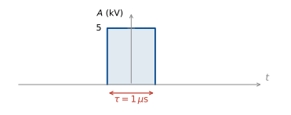
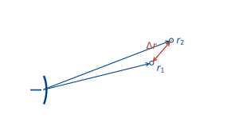
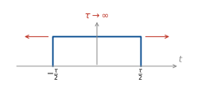
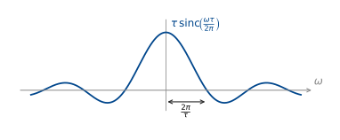
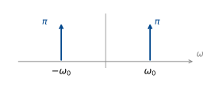
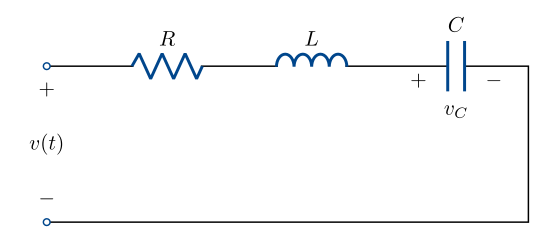
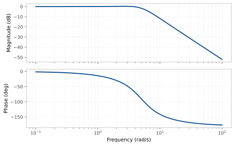

::: {.content-visible when-format="html"}
::: {.format-links}
[Other formats:]{.label}
```{=html}
<a href="notes.pdf" title="Week 5 lecture notes as a PDF"
   data-goatcounter-click="pdf-week5"
   data-goatcounter-title="Week 5 notes PDF opened">&#128196;&nbsp;PDF</a>
```
:::
:::

::: {.content-visible when-format="pdf"}
The figures below are snapshots of interactive widgets. The live versions, where
you can move the sliders yourself, are at
[tchaffey.com/elec2302](https://tchaffey.com/elec2302/?ref=notes-pdf-week5).
:::

1. Quiz 1 review/questions
2. Periodic $\longrightarrow$ aperiodic: motivation
3. Fourier transform as the limit of the Fourier series
4. Fourier transform vs Fourier series: what changed?
5. Fourier transform pairs
6. Properties of the Fourier transform.
7. Examples: radar, optics, RLC.

---

<u>Last week</u>: we represented a <u>periodic</u> signal as the sum of sinusoids, using
the Fourier series.

This gave us a <u>spectrum</u>: the frequency content of the signal.

<u>But</u>: most signals are not periodic: a radar pulse, a plucked note, a spoken
word …

<u>Question of the lecture</u>: what does the spectrum of a one-off signal look like?

<u>Core idea</u>: we can take the Fourier series of a $T$-periodic signal and let
$T \to \infty$ to get an aperiodic signal.

## Periodic $\longrightarrow$ aperiodic: motivation

Let's illustrate this by example: a pulse train, like a radar signal.

Take

$$
u_T(t) = A\sum_{m\in\mathbb{Z}} p_\tau(t-mT), \qquad
p_\tau(t) = \begin{cases} 1, & |t| < \dfrac{\tau}{2} \\[6pt] 0, & |t| > \dfrac{\tau}{2}\end{cases},
\qquad 0 < \tau < T .
$$

::: {style="text-align:center"}
![The pulse train $u_T(t)$: amplitude $A$, pulse width $\tau$, period $T$. The red bracket marks the period $[-\tfrac{T}{2},\tfrac{T}{2}]$ used for the coefficient integral.](fig/pulse-train.svg){width=680}
:::

$\tau$ varies on time. $\;$ $T$ varies the period. $\;$ The ratio $\dfrac{\tau}{T}$ is
called the "duty cycle".

<!-- CHECK: the source line reads "τ varies on time." — presumably "τ varies the *on time*" (the pulse-on duration). Transcribed as written. -->

Let's calculate the Fourier series coefficients over the red period,
$[-\tfrac{T}{2}, \tfrac{T}{2}]$. This contains a single pulse.

$$
\begin{aligned}
c_k &= \frac{1}{T}\int_{-T/2}^{T/2} u_T(t)\,e^{-jk\omega_0 t}\,\mathrm{d}t
 && \left(\omega_0 = \frac{2\pi}{T}\right) \\[8pt]
&= \frac{A}{T}\int_{-\tau/2}^{\tau/2} e^{-jk\omega_0 t}\,\mathrm{d}t
 && \left(T = \frac{2\pi}{\omega_0}\right)
\end{aligned}
$$

$k = 0$:

$$ c_0 = \frac{A}{T}\int_{-\tau/2}^{\tau/2} 1\,\mathrm{d}t = \frac{A\tau}{T}. $$

::: {.note}
<span class="out">Use evenness — only need cos series.</span>
:::

$k \neq 0$:

$$
\begin{aligned}
c_k &= \frac{A}{T}\left[\frac{e^{-jk\omega_0 t}}{-jk\omega_0}\right]_{-\tau/2}^{\tau/2}
 = \frac{A\omega_0}{2\pi}\,\frac{1}{-jk\omega_0}
   \left(e^{-jk\omega_0 \frac{\tau}{2}} - e^{\,jk\omega_0 \frac{\tau}{2}}\right) \\[8pt]
&= \frac{Aj}{2\pi k}\left(-2j\sin\!\left(\frac{k\omega_0\tau}{2}\right)\right) \\[8pt]
&= \frac{A}{\pi k}\sin\!\left(k\,\frac{\pi\tau}{T}\right) \\[8pt]
&= A\,\frac{\sin(\pi k d)}{\pi k}
 && \left(d = \frac{\tau}{T}\right)
\end{aligned}
$$

$$ \boxed{\; c_k = A\,d\,\operatorname{sinc}(kd). \;} $$

::: {.note}
Recall: $\operatorname{sinc}(x) = \dfrac{\sin(\pi x)}{\pi x}$.
:::

## Fourier transform as the limit of the Fourier series

Now, how does this depend on the period $T$?

$$
\begin{aligned}
c_k &= A\,\frac{\tau}{T}\operatorname{sinc}\!\left(k\,\frac{\tau}{T}\right) \\[6pt]
    &= A\,\frac{\tau}{T}\operatorname{sinc}\!\left(k\,\frac{\tau\omega_0}{2\pi}\right).
\end{aligned}
$$

Call $k\omega_0 = \omega$. Then

$$ T c_k = A\tau \operatorname{sinc}\!\left(\frac{\tau\omega}{2\pi}\right) =: E(\omega)
\qquad \text{("envelope")} $$

::: {.content-visible when-format="html"}
```{=html}
<div id="w-sample" class="widget"></div>
```
:::

::: {.content-visible when-format="pdf"}
{#fig-sample width=100%}
:::

Where are the zeros?

$$
\begin{aligned}
\operatorname{sinc}\!\left(\frac{\tau\omega}{2\pi}\right) &= 0 \\[6pt]
\sin\!\left(\frac{\tau\omega}{2}\right) &= 0 \\[6pt]
\frac{\tau\omega}{2} &= n\pi \quad \text{for } n \in \mathbb{Z} \\[6pt]
\omega &= \frac{n2\pi}{\tau}.
\end{aligned}
$$

What happens as $T \to \infty$?

★ $E(\omega)$ doesn't change

★ Spacing becomes smaller.

What happens to the coefficients $c_k$?

Let's define $u(t) = \displaystyle\lim_{T\to\infty} u_T(t)$.

$$ c_k = \frac{1}{T}\int_{-T/2}^{T/2} u_T(t)\,e^{-jk\omega_0 t}\,\mathrm{d}t $$

<!-- CHECK: the source writes the integrand as x_T(t) here (and "the Fourier transform of x(t)" below), while the surrounding pages use u_T / u. Transcribed with u throughout, per the course notation. -->

We define the <u>Fourier transform</u> of $u(t)$ by

$$
\boxed{\;
U(j\omega) := \lim_{T\to\infty} T c_k \Big|_{k\omega_0 \to \omega}
= \int_{-\infty}^{\infty} u(t)\,e^{-j\omega t}\,\mathrm{d}t .
\;}
$$

This can be calculated for <u>any signal</u> for which the integral converges.

We know that the Fourier series can be used to reconstruct the original signal:

$$
\boxed{\;
u_T = \sum_{k=-\infty}^{\infty} c_k \phi_k
    = \sum_{k=-\infty}^{\infty} \langle u_T, \phi_k\rangle_P\,\phi_k,
\qquad \phi_k(t) = e^{\,jk\omega_0 t}
\;}
$$

<!-- CHECK: the source writes φ_k(t) = e^{jkωt}; here the fundamental is ω₀, so typeset as e^{jkω₀t}. -->

::: {.note}
Week 4 lecture.
:::

Do we get something similar in the Fourier transform limit?

We can rewrite the Fourier series as

$$
\begin{aligned}
u_T(t) &= \sum_{k=-\infty}^{\infty} T c_k\, e^{\,jk\omega_0 t}\,\frac{1}{T}
 && \left[\text{trying to get a “}\mathrm{d}\omega\text{” on the RHS}\right] \\[8pt]
&= \sum_{k=-\infty}^{\infty} T c_k\, e^{\,jk\omega_0 t}\,\frac{\omega_0}{2\pi}
 && \left[\omega_0 = \text{spacing between samples}\right] \\[8pt]
&= \sum_{k=-\infty}^{\infty} T c_k\, e^{\,j\omega t}\,\frac{\Delta\omega}{2\pi}.
\end{aligned}
$$

Then in the limit,

$$ u(t) = \lim_{T\to\infty} \sum_{k=-\infty}^{\infty} T c_k\, e^{\,j\omega t}\,
   \frac{\Delta\omega}{2\pi}. $$

$$
\boxed{\;
u(t) = \frac{1}{2\pi}\int_{-\infty}^{\infty} U(j\omega)\,e^{\,j\omega t}\,\mathrm{d}\omega
\;}
\qquad \text{(the Inverse Fourier transform).}
$$

We have illustrated this above for a pulse chain, but it holds for <u>any signal</u> for
which the Fourier transform integral converges
$\left(\int_{-\infty}^{\infty}|u(t)|\,\mathrm{d}t < \infty \text{ is sufficient}\right)$.

## What has changed versus the Fourier series?

1. Sum $\longmapsto$ integral, discrete index $k \longmapsto$ continuous variable,
   $k\omega_0 \longmapsto \omega$.

2. Units change. $c_k$ has the same units as $u$. $U(j\omega)$ has units of
   $u \times \text{time}$: it is a density. Must be integrated to get anything.

<!-- CHECK: the source writes X(jω) in point 2; transcribed as U(jω) for consistency with the boxed definition. -->

<u>Example</u>: the Kurnell weather radar from the week 2 tutorial.

::: {style="text-align:center"}
{width=460}
:::

The parameters $\tau$ and $T$ are varied independently:

$\tau$ adjusts range resolution:

::: {style="text-align:center"}
{width=460}
:::

Consider two targets at ranges $r_1$ and $r_2$, with $\Delta r := r_2 - r_1$.

The round trip time for each pulse $t_d = \dfrac{2r}{c}$
$\;(c = 3\times10^{8}\ \mathrm{m\,s^{-1}})$.

$$ \Delta t_d = \frac{2\Delta r}{c}. $$

If $\Delta t_d < \tau$, the returning pulses overlap and can't be distinguished.

The minimum distance that can be measured is therefore $\Delta r = \dfrac{c\tau}{2}$.
For Kurnell, $\tau = 1\,\mu$s, so $\Delta r \approx 150\,$m.

<u>Why not make $\tau$ even smaller?</u>

Let's check the spectrum again.

::: {.content-visible when-format="html"}
```{=html}
<div id="w-tau" class="widget"></div>
```
:::

::: {.content-visible when-format="pdf"}
{#fig-tau width=100%}
:::

::: {.note}
(Higher lobes are filtered — week 10.)
:::

Small $\tau$ makes $\dfrac{2\pi}{\tau}$ big, so the lobe spreads and we need more
bandwidth to transmit the pulse. Bandwidth is tightly regulated and very expensive!

## Fourier transform pairs

The square $\longleftrightarrow$ sinc Fourier transform pair is useful for radar design.
Let's derive some other useful pairs.

**(a)** $u(t) = \delta(t)$.

$$
\begin{aligned}
U(j\omega) &= \int_{-\infty}^{\infty} \delta(t)\,e^{-j\omega t}\,\mathrm{d}t \\[6pt]
&= 1 \qquad \text{(sifting property)}.
\end{aligned}
$$

**(b)** $u(t) = e^{-at}H(t)$

$$
\begin{aligned}
U(j\omega) &= \int_{-\infty}^{\infty} e^{-at}H(t)\,e^{-j\omega t}\,\mathrm{d}t \\[6pt]
&= \int_{0}^{\infty} e^{-(a+j\omega)t}\,\mathrm{d}t \\[6pt]
&= \left[\frac{-1}{a+j\omega}\,e^{-(a+j\omega)t}\right]_{0}^{\infty} \\[6pt]
&= \frac{1}{a+j\omega}.
\end{aligned}
$$

:::: {.extension}
[Extension material]{.extension-label}

### $u(t) = 1$

::: {.note}
<span class="out">Skip this in lecture. Starred section in notes.</span>
:::

**(c)** $u(t) = 1$.

Treat this as the limit of a wide rectangle:

::: {style="text-align:center"}
{width=280}
:::

<!-- CHECK: the source sketch labels the rectangle edges −τ and τ; the transform used on the next line, τ sinc(ωτ/2π), is that of the width-τ pulse, so the edges are drawn at ∓τ/2. -->

We already have the Fourier transform of the rectangle:
$\;\tau\operatorname{sinc}\!\left(\dfrac{\tau\omega}{2\pi}\right)$.

What is the area under this curve?

$$
\begin{aligned}
A &= \int_{-\infty}^{\infty} \tau\,
     \frac{\sin\!\left(\frac{\tau\omega}{2}\right)}{\frac{\tau\omega}{2}}\,\mathrm{d}\omega \\[8pt]
  &= \int_{-\infty}^{\infty} \frac{2\sin\!\left(\frac{\tau\omega}{2}\right)}{\omega}\,\mathrm{d}\omega .
\end{aligned}
$$

Let $\mu = \dfrac{\tau\omega}{2} \iff \omega = \dfrac{2\mu}{\tau}$.

$\mathrm{d}\mu = \dfrac{\tau}{2}\,\mathrm{d}\omega \iff
\mathrm{d}\omega = \dfrac{2\,\mathrm{d}\mu}{\tau}$.

$$
\begin{aligned}
A &= \int_{-\infty}^{\infty} \frac{2\sin(\mu)}{\frac{2\mu}{\tau}}\,\frac{2\,\mathrm{d}\mu}{\tau} \\[8pt]
&= \int_{-\infty}^{\infty} \frac{2\sin(\mu)}{\mu}\,\mathrm{d}\mu \\[8pt]
&= \int_{0}^{\infty} \frac{4\sin(\mu)}{\mu}\,\mathrm{d}\mu
 \qquad \text{(even function)}.
\end{aligned}
$$

Fact: $\displaystyle\int_{0}^{\infty}\frac{\sin(\mu)}{\mu}\,\mathrm{d}\mu = \frac{\pi}{2}$
(full derivation in the notes).

So the Fourier transform of the width $\tau$ pulse has <u>constant area $2\pi$</u>.

::: {style="text-align:center"}
{width=520}
:::

As we increase $\tau$, the sinc gets taller and narrower.

In the limit $\tau \to \infty$, we have <u>an impulse with area $2\pi$</u>.

<!-- CHECK: the source reads "As we reduce τ, the sinc gets taller and narrower. In the limit τ → 0, we have an impulse with area 2π." The height of the transform is τ and its lobe width is 2π/τ, so it is *increasing* τ that makes it taller and narrower, and u(t) = 1 is the τ → ∞ limit. Typeset in the direction consistent with the algebra above. -->

So $\; 1 \;\overset{\text{FT}}{\longrightarrow}\; 2\pi\delta(\omega)$.

::::

**(d)** $e^{\,j\omega_0 t} \longrightarrow 2\pi\delta(\omega - \omega_0)$

We already have the Fourier transform of $1$:

$$ \int_{-\infty}^{\infty} 1\cdot e^{-j\omega t}\,\mathrm{d}t = 2\pi\delta(\omega). $$

$$ \int_{-\infty}^{\infty} e^{\,j\omega_0 t}e^{-j\omega t}\,\mathrm{d}t
 = \int_{-\infty}^{\infty} e^{-j(\omega-\omega_0)t}\,\mathrm{d}t
 = 2\pi\delta(\omega-\omega_0). $$

<!-- CHECK: the source writes the middle integrand as e^{+j(ω−ω₀)t}; collecting the two exponentials gives e^{−j(ω−ω₀)t}. The value is the same either way since δ is even. -->

So

$$ \cos(\omega_0 t) = \tfrac{1}{2}\left(e^{\,j\omega_0 t} + e^{-j\omega_0 t}\right)
 \;\overset{\text{FT}}{\rightsquigarrow}
 \pi\delta(\omega-\omega_0) + \pi\delta(\omega+\omega_0) $$

<!-- CHECK: the source writes cos(ωt) = ½(e^{jωt} − e^{−jωt}); the identity with the minus sign is sin, and the right-hand side is a cosine pair, so typeset with "+" and with ω₀ to match the deltas. -->

::: {style="text-align:center"}
{width=330}
:::

The Fourier series!

## Properties of the Fourier transform

This is also a useful general property of the Fourier transform:

**①** $\; e^{\,j\omega_0 t}u(t) \;\longleftrightarrow\; U\big(j(\omega-\omega_0)\big)$
$\qquad$ (frequency shift)

<!-- CHECK: the source writes "e^{−ω₀t} u(t) ⟷ U(ω−ω₀)". A shift of the spectrum to ω−ω₀ comes from multiplying by e^{+jω₀t}, so the exponent is typeset as +jω₀t, and the argument as j(ω−ω₀) to match the U(jω) notation. -->

There are several other useful properties:

**②** $u(t-t_0)$:

$$
\begin{aligned}
\int_{-\infty}^{\infty} u(t-t_0)\,e^{-j\omega t}\,\mathrm{d}t
&= \int_{-\infty}^{\infty} u(\tau)\,e^{-j\omega(\tau+t_0)}\,\mathrm{d}\tau
&& \left[\tau = t - t_0,\; t = \tau + t_0,\; \mathrm{d}\tau = \mathrm{d}t\right] \\[6pt]
&= e^{-j\omega t_0}\,U(j\omega).
\end{aligned}
$$

$$ u(t-t_0) \;\longleftrightarrow\; e^{-j\omega t_0}\,U(j\omega) \qquad \text{(time shift)}. $$

**③** $u(at)$:

$$ \int_{-\infty}^{\infty} u(at)\,e^{-j\omega t}\,\mathrm{d}t. \qquad
\text{Let } \tau = at, \;\; \mathrm{d}\tau = a\,\mathrm{d}t, \;\; t = \frac{\tau}{a}. $$

$$
\begin{aligned}
&= \frac{a}{|a|}\int_{-\infty}^{\infty} u(\tau)\,e^{-j\omega\frac{\tau}{a}}\,\frac{\mathrm{d}\tau}{a}
&& \left[\text{to get the limits the right way}\right] \\[6pt]
&= \frac{1}{|a|}\int_{-\infty}^{\infty} u(\tau)\,e^{-j\frac{\omega}{a}\tau}\,\mathrm{d}\tau \\[6pt]
&= \frac{1}{|a|}\,U\!\left(\frac{j\omega}{a}\right).
\end{aligned}
$$

$$ u(at) \;\longleftrightarrow\; \frac{1}{|a|}U\!\left(\frac{j\omega}{a}\right)
\qquad \text{(time scaling)}. $$

**④** $\;\alpha u_1(t) + \beta u_2(t) \;\longleftrightarrow\;
\alpha U_1(j\omega) + \beta U_2(j\omega) \qquad$ (linearity).

**⑤** $y = h * u$.

$$ y(t) = \int_{-\infty}^{\infty} h(t-\tau)\,u(\tau)\,\mathrm{d}\tau $$

$$
\begin{aligned}
Y(j\omega) &= \int_{-\infty}^{\infty}\!\int_{-\infty}^{\infty} h(t-\tau)u(\tau)\,\mathrm{d}\tau\;
   e^{-j\omega t}\,\mathrm{d}t \\[6pt]
&= \int_{-\infty}^{\infty}\!\int_{-\infty}^{\infty} h(t-\tau)\,e^{-j\omega t}\,\mathrm{d}t\;
   u(\tau)\,\mathrm{d}\tau
&& \left[\text{using Fubini's theorem}\right]
\end{aligned}
$$

Let $\mu = t - \tau$. $\;\mathrm{d}t = \mathrm{d}\mu$. $\;t = \mu + \tau$.

$$
\begin{aligned}
Y(j\omega) &= \int_{-\infty}^{\infty}\!\int_{-\infty}^{\infty}
   h(\mu)\,e^{-j\omega(\mu+\tau)}\,\mathrm{d}\mu\; u(\tau)\,\mathrm{d}\tau \\[6pt]
&= \int_{-\infty}^{\infty} h(\mu)\,e^{-j\omega\mu}\,\mathrm{d}\mu
   \int_{-\infty}^{\infty} u(\tau)\,e^{-j\omega\tau}\,\mathrm{d}\tau
\end{aligned}
$$

$$ Y(j\omega) = H(j\omega)\,U(j\omega) $$

$$ \boxed{\; y = h*u \;\longleftrightarrow\; Y = HU \;}
\qquad \text{(convolution)} $$

This is the foundation of the rest of the course.

**⑥** $\dfrac{\mathrm{d}}{\mathrm{d}t}u(t) \;\rightsquigarrow\;
\displaystyle\int_{-\infty}^{\infty}\frac{\mathrm{d}}{\mathrm{d}t}u(t)\,e^{-j\omega t}\,\mathrm{d}t$

Integrate by parts: $\displaystyle\int u'v = uv - \int uv'$

$$
\begin{aligned}
\int_{-\infty}^{\infty}\frac{\mathrm{d}}{\mathrm{d}t}u(t)\,e^{-j\omega t}\,\mathrm{d}t
&= \underbrace{\left[u(t)e^{-j\omega t}\right]_{-\infty}^{\infty}}_{=\,0 \text{ if } u(-\infty) = u(\infty) = 0}
 + j\omega\int_{-\infty}^{\infty} u(t)\,e^{-j\omega t}\,\mathrm{d}t \\[6pt]
&= j\omega\,U(j\omega).
\end{aligned}
$$

So

$$ \boxed{\; \frac{\mathrm{d}}{\mathrm{d}t}u(t) \;\longleftrightarrow\; j\omega\,U(j\omega). \;} $$

### Summary

<!-- CHECK: the source says "Include summary table here." — the table below is assembled from the pairs and properties derived above, with nothing added. -->

**Transform pairs.**

| $u(t)$ | $U(j\omega)$ | derived in |
|---|---|---|
| $A\,p_\tau(t)$ | $A\tau\operatorname{sinc}\!\left(\dfrac{\omega\tau}{2\pi}\right)$ | §2 |
| $\delta(t)$ | $1$ | (a) |
| $e^{-at}H(t)$ | $\dfrac{1}{a+j\omega}$ | (b) |
| $1$ | $2\pi\delta(\omega)$ | (c) |
| $e^{\,j\omega_0 t}$ | $2\pi\delta(\omega-\omega_0)$ | (d) |
| $\cos(\omega_0 t)$ | $\pi\delta(\omega-\omega_0) + \pi\delta(\omega+\omega_0)$ | (d) |

**Properties.**

| | $u(t)$ | $U(j\omega)$ |
|---|---|---|
| ① frequency shift | $e^{\,j\omega_0 t}u(t)$ | $U\big(j(\omega-\omega_0)\big)$ |
| ② time shift | $u(t-t_0)$ | $e^{-j\omega t_0}U(j\omega)$ |
| ③ time scaling | $u(at)$ | $\dfrac{1}{\lvert a\rvert}U\!\left(\dfrac{j\omega}{a}\right)$ |
| ④ linearity | $\alpha u_1(t) + \beta u_2(t)$ | $\alpha U_1(j\omega) + \beta U_2(j\omega)$ |
| ⑤ convolution | $y = h*u$ | $Y = HU$ |
| ⑥ differentiation | $\dfrac{\mathrm{d}}{\mathrm{d}t}u(t)$ | $j\omega\,U(j\omega)$ |
| ⑦ duality | $X(jt)$ | $2\pi x(-\omega)$ |
| ⑧ Parseval | $\displaystyle\int_{-\infty}^{\infty} u(t)\overline{y(t)}\,\mathrm{d}t$ | $\displaystyle\frac{1}{2\pi}\int_{-\infty}^{\infty} U(j\omega)\overline{Y(j\omega)}\,\mathrm{d}\omega$ |

### Other properties

(Proofs in lecture notes.)

**⑦ Duality:** if $x(t) \rightsquigarrow X(j\omega)$, then

$$ X(jt) \;\rightsquigarrow\; 2\pi x(-\omega). $$

::: {.note}
**Proof:**

$$
\begin{aligned}
x(-\omega) &= \frac{1}{2\pi}\int_{-\infty}^{\infty} X(js)\,e^{-j\omega s}\,\mathrm{d}s \\[6pt]
&= \frac{1}{2\pi}\,\mathcal{F}\{X(jt)\}(\omega).
\end{aligned}
$$
:::

<!-- CHECK: the source writes the left-hand side as x(−t) with the integrand e^{−jωs}; for the second line to read F{X(jt)}(ω) the left-hand side must be x(−ω). Typeset as x(−ω). -->

<u>Example</u>: we know $\delta(t) \rightsquigarrow 1$.

The dual gives us another pair: $\;1 \rightsquigarrow 2\pi\delta(\omega)$.

**⑧ Parseval's theorem:**

$$ \int_{-\infty}^{\infty} u(t)\,\overline{y(t)}\,\mathrm{d}t
 = \frac{1}{2\pi}\int_{-\infty}^{\infty} U(j\omega)\,\overline{Y(j\omega)}\,\mathrm{d}\omega. $$

Special case: if $y = u$:

$$ \int_{-\infty}^{\infty} |u(t)|^2\,\mathrm{d}t
 = \frac{1}{2\pi}\int_{-\infty}^{\infty} |U(j\omega)|^2\,\mathrm{d}\omega. $$

::: {.note}
**Proof:**

$$
\begin{aligned}
\int u\bar{y}\,\mathrm{d}t
&= \int u(t)\,\frac{1}{2\pi}\int \overline{Y(j\omega)\,e^{\,j\omega t}}\,\mathrm{d}\omega\;\mathrm{d}t \\[6pt]
&= \frac{1}{2\pi}\int\left[\int u(t)\,e^{-j\omega t}\,\mathrm{d}t\right]\overline{Y(j\omega)}\,\mathrm{d}\omega \\[6pt]
&= \frac{1}{2\pi}\int U(j\omega)\,\overline{Y(j\omega)}\,\mathrm{d}\omega .
\end{aligned}
$$
:::

## Example: the RLC circuit

<u>Example</u>: RLC circuit with $v_C$ as output.

::: {style="text-align:center"}
{width=540}
:::

We know the impulse response is

$$ g(t) = 6.25\,e^{-3t}\sin(4t)\,H(t). $$

What is the spectrum of this signal?

$$ \sin(4t) = \frac{1}{2j}\left(e^{\,j4t} - e^{-j4t}\right) $$

So

$$ g(t) = \frac{6.25}{2j}\left(e^{(-3+4j)t} - e^{(-3-4j)t}\right). $$

Use the Fourier transform pair $e^{-at}H(t) = \dfrac{1}{a+j\omega}$:

$$
\begin{aligned}
G(j\omega) &= -3.125j\left(\frac{1}{-(-3+4j)+j\omega} - \frac{1}{-(-3-4j)+j\omega}\right) \\[10pt]
&= -3.125j\left(\frac{(+3+4j+j\omega) - (+3-4j+j\omega)}{(+3-4j+j\omega)(+3+4j+j\omega)}\right) \\[10pt]
&= -3.125j\left(\frac{8j}{(+3-4j)(+3+4j) + j\omega(+3-4j) + (+3+4j)j\omega - \omega^2}\right) \\[10pt]
&= \frac{25}{-\omega^2 + 6j\omega + 25}.
\end{aligned}
$$

<!-- CHECK: two sign slips in the source's middle lines. (i) The first denominator is written "(−3+4j)+jω" without the leading minus, although the line below expands it as (+3−4j+jω); typeset with the minus. (ii) The combined numerator is written "−3−4j+jω − (−3+4j+jω)" = −8j; combining 1/(3−4j+jω) − 1/(3+4j+jω) gives (3+4j+jω) − (3−4j+jω) = +8j, which is what produces the +25 in the author's final answer (−3.125j × 8j = +25). -->

What does the spectrum look like?

::: {style="text-align:center"}
{width=620}
:::

```{=html}
<script src="fourier-widgets.js"></script>
```
