::: {.content-visible when-format="html"}
::: {.format-links}
[Other formats:]{.label}
```{=html}
<a href="notes.pdf" title="Week 6 lecture notes as a PDF"
   data-goatcounter-click="pdf-week6"
   data-goatcounter-title="Week 6 notes PDF opened">&#128196;&nbsp;PDF</a>
```
:::
:::

::: {.content-visible when-format="pdf"}
The figures below are snapshots of interactive widgets. The live versions, where
you can move the sliders yourself, are at
[tchaffey.com/elec2302](https://tchaffey.com/elec2302/?ref=notes-pdf-week6).
:::

## Lecture outline

0. Recap of Fourier transform
2. Response to arbitrary inputs.
1. Impulse response & convolution with exponentials.
3. Finding the impulse response
4. Interconnection
5. Plotting the impulse response
6. First order systems
7. Second order systems & resonance
8. Periodic inputs.
9. Cascades & string instability.


```{=html}
<hr style="border:0;border-top:1.5px solid #00468C;margin:1.6em 0;">
```

## Recap: the Fourier transform

★ Expresses a signal as an <u>integral</u> of <u>sinusoidal</u> components.

$$ U(j\omega) = \int_{-\infty}^{\infty} u(t)\,e^{-j\omega t}\,\mathrm{d}t $$

(The Fourier transform, generalises Fourier series coefficients).

$$ u(t) = \frac{1}{2\pi}\int_{-\infty}^{\infty} U(j\omega)\,e^{\,j\omega t}\,\mathrm{d}\omega $$

(The inverse Fourier transform, generalises the Fourier series).

**Transform pairs.**

| $u(t)$ | $U(j\omega)$ |
|---|---|
| $A\,p_\tau(t)$ | $A\tau\operatorname{sinc}\!\left(\dfrac{\omega\tau}{2\pi}\right)$ |
| $\delta(t)$ | $1$ |
| $e^{-at}H(t)$ | $\dfrac{1}{a+j\omega}$ |
| $1$ | $2\pi\delta(\omega)$ |
| $e^{\,j\omega_0 t}$ | $2\pi\delta(\omega-\omega_0)$ |
| $\cos(\omega_0 t)$ | $\pi\delta(\omega-\omega_0) + \pi\delta(\omega+\omega_0)$ |

Two most important properties:

$$ \frac{\mathrm{d}}{\mathrm{d}t}u(t) \;\rightsquigarrow\; j\omega\,U(j\omega)
\qquad(1) $$

$$ u * y \;\rightsquigarrow\; U(j\omega)\,Y(j\omega) \qquad(2) $$

Why are these useful? $\;$ (1) — find $h(t)$.

$\qquad\qquad\qquad\qquad\;\,$ (2) — calculate output to any input once we have $h(t)$.

## Finding the impulse response

Let's see how. $\;$ <u>RLC circuit</u>

::: {style="text-align:center"}
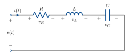{width=560}
:::

$$ g(t) = 6.25\,e^{-3t}\sin(4t)\,H(t). $$

$v$ input, $v_C$ output.

KVL: $\;v_R + v_L + v_C = v$.

$$
\begin{aligned}
i &= \frac{\mathrm{d}}{\mathrm{d}t}C v_C \\[6pt]
v_L &= \frac{\mathrm{d}}{\mathrm{d}t}L i \\[6pt]
    &= \frac{\mathrm{d}^2}{\mathrm{d}t^2}LC v_C \\[6pt]
v_R &= Ri \\[6pt]
    &= RC\frac{\mathrm{d}}{\mathrm{d}t}v_C .
\end{aligned}
$$

All together: $\;LC\dfrac{\mathrm{d}^2}{\mathrm{d}t^2}v_C + RC\dfrac{\mathrm{d}}{\mathrm{d}t}v_C + v_C = v$.

Now Fourier transform both sides:

$$ LC(j\omega)^2 V_C(j\omega) + RC\,j\omega\,V_C(j\omega) + V_C(j\omega) = V(j\omega) $$

If $u(t) = \delta(t)$, $V(j\omega) = 1$.

$$ G(j\omega) = V_C(j\omega) = \frac{1}{(j\omega)^2 LC + j\omega RC + 1} $$

::: {.note}
Check: same as the end of last lecture!
:::

This is the Fourier transform of the impulse response, which is called the
<u>transfer function</u>. Often we'll use $G(j\omega)$ as notation.

Now, given any other input $u(t) \rightsquigarrow U(j\omega)$, we know the output is
$y(t) = (u * h)(t) \rightsquigarrow Y(j\omega) = U(j\omega)G(j\omega)$.

## Response to arbitrary inputs

Let's see an example. With the values from last week,

$$ G(j\omega) = \frac{25}{(j\omega)^2 + 6j\omega + 25}. $$


We also have the spectrum of the Pulse:

$$ p_\tau(t) \;\rightsquigarrow\; \tau\operatorname{sinc}\!\left(\frac{\omega\tau}{2\pi}\right). $$

Let's shift the pulse so it starts at $t = 0$, not $t = -\dfrac{\tau}{2}$.

$$ u(t - t_0) \;\rightsquigarrow\; e^{-j\omega t_0}\,U(j\omega), $$

So

$$ p_\tau\!\left(t - \frac{\tau}{2}\right) \;\rightsquigarrow\;
e^{-j\omega\frac{\tau}{2}}\,\tau\operatorname{sinc}\!\left(\frac{\omega\tau}{2\pi}\right). $$

If we plug this into the circuit as the supply voltage $v(t)$, the output has Fourier
Transform

$$ Y(j\omega) = \frac{25}{(j\omega)^2 + 6j\omega + 25}\;
e^{-j\omega\frac{\tau}{2}}\,\tau\operatorname{sinc}\!\left(\frac{\omega\tau}{2\pi}\right). $$

To get the time domain output, inverse Fourier transform.

Painful by hand, but easy on a computer.

::: {.content-visible when-format="html"}
```{=html}
<div id="w-pulse-rlc" class="widget"></div>
```
:::

::: {.content-visible when-format="pdf"}
{#fig-pulse-rlc width=100%}
:::

## Convolution with exponentials

What happens to a sinusoidal input $v(t) = e^{\,j\omega_0 t}$?

In the time domain:

$$
\begin{aligned}
y = h * v &= \int_{-\infty}^{\infty} v(t-\tau)\,h(\tau)\,\mathrm{d}\tau \\[6pt]
&= \int_{-\infty}^{\infty} e^{\,j\omega_0 t}\,e^{-j\omega_0\tau}\,h(\tau)\,\mathrm{d}\tau \\[6pt]
&= \int_{-\infty}^{\infty} e^{-j\omega_0\tau}\,h(\tau)\,\mathrm{d}\tau\; e^{\,j\omega_0 t} \\[6pt]
&= G(j\omega_0)\,e^{\,j\omega_0 t}.
\end{aligned}
$$

Transfer function scales each frequency!

## Interconnections and transfer functions

::: {style="text-align:center"}
{width=520}
:::

In the frequency domain, this is just a product:
$\;Y(j\omega) = H_2(j\omega)H_1(j\omega)U(j\omega)$.

What about feedback?

::: {style="text-align:center"}
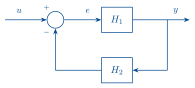{width=420}
:::

$$
\begin{aligned}
E(j\omega) &= U(j\omega) - H_2(j\omega)Y(j\omega) \\[6pt]
&= U(j\omega) - H_2(j\omega)H_1(j\omega)E(j\omega)
\end{aligned}
$$

$$ E(j\omega) = \frac{1}{1 + H_2(j\omega)H_1(j\omega)}\,U(j\omega). $$

$$ Y(j\omega) = H_1(j\omega)E(j\omega)
 = \frac{H_1(j\omega)}{1 + H_2(j\omega)H_1(j\omega)}\,U(j\omega). $$

<u>Example</u>: good question from last week's lecture.

RC circuit:

::: {style="text-align:center"}
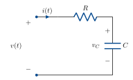{width=380}
:::

$$
\begin{aligned}
v_R &= Ri, & V_R(j\omega) &= R\,I(j\omega). \\[6pt]
i &= \frac{\mathrm{d}}{\mathrm{d}t}C v_C, & I(j\omega) &= j\omega C\,V_C(j\omega), \\[6pt]
& & V_C(j\omega) &= \frac{1}{j\omega C}\,I(j\omega).
\end{aligned}
$$

KVL: $\;v = v_C + v_R$

$$
\begin{aligned}
V(j\omega) &= V_C(j\omega) + V_R(j\omega) && \text{(Fourier transform is linear)}. \\[6pt]
&= \left(R + \frac{1}{j\omega C}\right)I(j\omega).
\end{aligned}
$$

::: {style="text-align:center"}
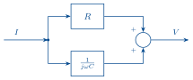{width=460}
:::

What about $I$ to $V$?

::: {.columns}
::: {.column width="62%"}
$$
\begin{aligned}
I(j\omega) &= \frac{1}{R + \dfrac{1}{j\omega C}}\,V(j\omega) \\[10pt]
&= \frac{j\omega C}{j\omega RC + 1}\,V(j\omega).
\end{aligned}
$$
:::
::: {.column width="38%"}
$$ \frac{\dfrac{1}{j\omega C}}{1 + \dfrac{R}{j\omega C}} $$
:::
:::

::: {style="text-align:center"}
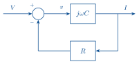{width=420}
:::

feedback of $j\omega C$ (capacitor maps voltage to current). with $R$ (resistor maps
current to voltage).

## Decibels

Power & amplitude.

Power gain is measured in power decibels:

$$ \alpha^2\;(\mathrm{V}^2) \;\rightsquigarrow\; 10\log_{10}\alpha^2 \quad (\mathrm{dB}). $$

Amplitude gain is measured in amplitude decibels:

$$ \alpha\;(\mathrm{V}) \;\rightsquigarrow\; 20\log_{10}\alpha \quad (\mathrm{dB}). $$

Why the factor of 2? $\;10\log_{10}\alpha^2 = 20\log_{10}\alpha$.

Makes power and amplitude consistent.

## Plotting the impulse response

There are a few ways to plot the impulse response.

The most common is the <u>Bode Diagram</u>, which plots the argument and amplitude of
$G(j\omega)$ on two separate plots.

Amplitude is measured in decibels, $20\log_{10}|G(j\omega)|$.

Frequency is plotted on a log scale.

For example,

$$ \frac{25}{(j\omega)^2 + 6j\omega + 25} $$

::: {style="text-align:center"}
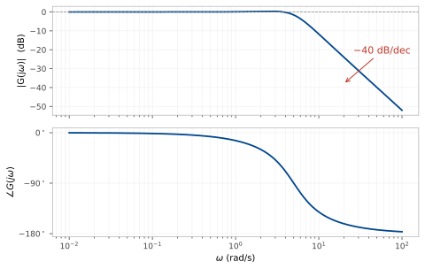{width=660}
:::

What does this plot say?

::: {.content-visible when-format="html"}
```{=html}
<div id="w-bode-probe" class="widget"></div>
```
:::

::: {.content-visible when-format="pdf"}
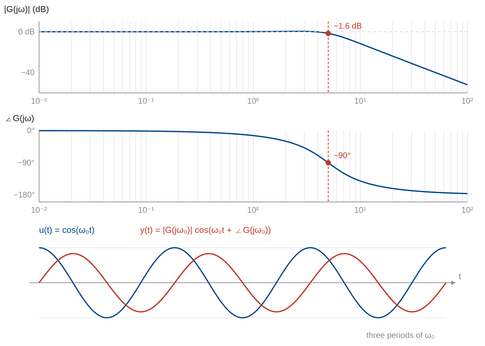{#fig-bode-probe width=100%}
:::

## First order systems

(one memory component).

::: {.columns}
::: {.column width="55%"}
Differential equation:

$$ \tau\dot{y} = -y + \beta u $$

$$ \tau j\omega Y(j\omega) = -Y(j\omega) + \beta U(j\omega). $$

$$ Y(j\omega) = \frac{\beta}{\tau j\omega + 1}U(j\omega). $$
:::
::: {.column width="45%"}
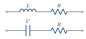{width=270}
:::
:::

What does the impulse response look like? (Quiz 1).

::: {style="text-align:center"}
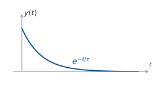{width=420}
:::

### Bode diagram

::: {style="text-align:center"}
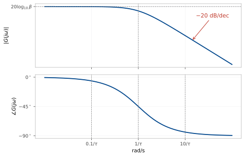{width=660}
:::

## Second order systems

Second order systems have two <u>poles</u>.

We can write a second order system in a standard form:

$$ G(j\omega) = \frac{K\omega_n^2}{(j\omega)^2 + 2\omega_n\zeta(j\omega) + \omega_n^2} $$

::: {.note}
<span class="out">We will often assume $K =1$.</span>
:::

$\omega_n$ is called the <u>natural frequency</u>.

$\zeta$ is called the <u>damping ratio</u>.

The roots of the polynomial $(j\omega)^2 + 2\omega_n\zeta(j\omega) + \omega_n^2$ are the
<u>poles</u>:

$$
\begin{aligned}
j\omega &= \frac{-2\omega_n\zeta \pm \sqrt{4\omega_n^2\zeta^2 - 4\omega_n^2}}{2} \\[8pt]
&= -\omega_n\left(\zeta \pm \sqrt{\zeta^2 - 1}\right).
\end{aligned}
$$

Three cases:

$\zeta > 1$: two distinct real poles (overdamped)

$\zeta = 1$: two identical real poles (critically damped)

$\zeta < 1$: complex conjugate poles (underdamped).

Recall from lecture 1: imaginary part gives rotation/oscillation.

Are these the same poles as lecture 1? Yes!

$$ G(j\omega) = \frac{A}{(j\omega + p_1)} + \frac{B}{(j\omega + p_2)}. $$

Each pole $\overset{\text{I.F.T.}}{\rightsquigarrow} e^{-p_i t}$.

We can get the Bode diagram of a critically/over damped system by cascading two first
order systems:

::: {style="text-align:center"}
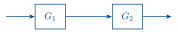{width=340}
:::

$$ |G(j\omega)| = |G_1(j\omega)G_2(j\omega)| $$

$$
\begin{aligned}
20\log_{10}|G_1(j\omega)G_2(j\omega)| &= 20\log_{10}|G_1(j\omega)||G_2(j\omega)| \\[6pt]
&= 20\log_{10}|G_1(j\omega)| + 20\log_{10}|G_2(j\omega)|
\end{aligned}
$$

$$ \angle G_1(j\omega)G_2(j\omega) = \angle G_1(j\omega) + \angle G_2(j\omega) $$

Cascade $\rightsquigarrow$ add magnitudes, add phases.

::: {.columns}
::: {.column width="50%"}
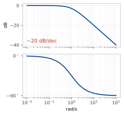{width=330}
:::
::: {.column width="50%"}
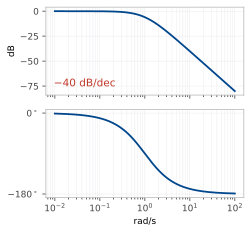{width=330}
:::
:::

What about complex poles?

If the damping is low enough, the system <u>amplifies</u> some frequencies.

$$ |G(j\omega)|^2 = \left|\frac{\omega_n^2}{(j\omega)^2 + 2\zeta\omega_n(j\omega) + \omega_n^2}\right|^2
 = \frac{\omega_n^4}{(\omega_n^2-\omega^2)^2 + 4\zeta^2\omega_n^2\omega^2} $$

Let $x = \omega^2$.

$$ |G(j\omega)|^2 = \frac{\omega_n^4}{(\omega_n^2 - x)^2 + 4\zeta^2\omega_n^2 x}. $$

Let's minimise the denominator to find the maximum gain:

$$ \min_x\left[(\omega_n^2 - x)^2 + 4\zeta^2\omega_n^2 x\right] $$

Diff. w.r.t. $x$ and set to $0$:

$$
\begin{aligned}
-2(\omega_n^2 - x) + 4\zeta^2\omega_n^2 &= 0. \\[6pt]
x &= \omega_n^2\left(1 - 2\zeta^2\right).
\end{aligned}
$$

This is positive only when $\zeta < \dfrac{1}{\sqrt{2}}$.

In this case, $\omega_r = \sqrt{x} = \omega_n\sqrt{1 - 2\zeta^2}$ is the
<u>resonant frequency</u>.

The lower the damping ratio, the more the resonant frequency is amplified.

::: {.content-visible when-format="html"}
```{=html}
<div id="w-resonant-peak" class="widget"></div>
```
:::

::: {.content-visible when-format="pdf"}
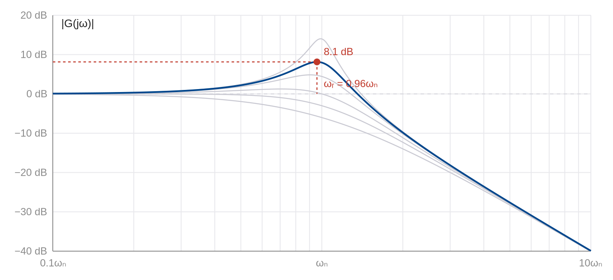{#fig-resonant-peak width=100%}
:::

## Periodic inputs

We developed the Fourier transform for aperiodic inputs. But if we have a periodic input
to a system with aperiodic impulse response, we need to convolve a periodic signal with
an aperiodic one. For this, we need the Fourier transform of a periodic signal.

From last week, we know that $e^{\,j\omega_0 t} \rightsquigarrow 2\pi\delta(\omega - \omega_0)$.

The Fourier series (week 4 lecture) is

$$ u(t) = \sum_{k=-\infty}^{\infty} c_k\,e^{\,jk\omega_0 t}. $$

Combining, we have

$$ U(j\omega) = \sum_{k=-\infty}^{\infty} c_k\,2\pi\,\delta(\omega - k\omega_0).
\qquad(3) $$

Check:

$$
\begin{aligned}
\cos(\omega_0 t) &= \tfrac{1}{2}\left(e^{\,j\omega_0 t} + e^{-j\omega_0 t}\right) \\[6pt]
c_{-1} &= \tfrac{1}{2}, \qquad c_1 = \tfrac{1}{2}.
\end{aligned}
$$

In (3): $\;U(j\omega) = \pi\delta(\omega - \omega_0) + \pi\delta(\omega + \omega_0)$.

## Example: cascading resonant systems & traffic dynamics

Setup: one car following another.

::: {style="text-align:center"}
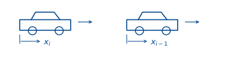{width=560}
:::

Car is a mass with acceleration governed by throttle & brakes:

$$
\begin{aligned}
M\ddot{x}_i &= a_i \\[6pt]
\ddot{x}_i &= \frac{a_i}{M}.
\end{aligned}
$$

Normalise so $M = 1$.

The driver tries to maintain a constant gap $d$ with the car in front.

If gap is too small/large, driver brakes/accelerates.

$$ a_i = k_p\left(x_{i-1} - x_i - d\right). $$

If gap is closing/opening too fast, driver brakes/accelerates more or less:

$$ a_i = k_p\left(x_{i-1} - x_i - d\right) + k_d\left(\dot{x}_{i-1} - \dot{x}_i\right) $$

Together:

$$ \ddot{x}_i + k_d\dot{x}_i + k_p x_i = k_d\dot{x}_{i-1} + k_p x_{i-1} - k_p d. $$

Let's find the transfer function from $x_{i-1}$ to $x_i$.

Offset $x_{i-1}$ by $d$ to get rid of the constant term.

$$ (j\omega)^2 X_i + k_d\,j\omega X_i + k_p X_i = k_d\,j\omega X_{i-1} + k_p X_{i-1}. $$

$$ X_i = \underbrace{\frac{k_d\,j\omega + k_p}{(j\omega)^2 + k_d\,j\omega + k_p}}_{T(j\omega)}\,X_{i-1}. $$

Now, judging a distance is much easier than judging a rate, so $k_d \ll k_p$.

The damping ratio is $\dfrac{k_d}{2\sqrt{k_p}} \ll 1$: underdamped.

::: {style="text-align:center"}
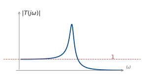{width=480}
:::

What happens if we have many cars following each other? Cascade transfer functions —
resonant peaks add. $\;(T(j\omega))^N$. $\;|T(j\omega)| > 1$ when
$k_p^2 > (k_p - \omega^2)^2$.

<u>Disturbance is amplified</u>: driver at the front tapping their brakes becomes a big
oscillation further back in the queue.

```{=html}
<script src="bode-widgets.js"></script>
```
