::: {.content-visible when-format="html"}
::: {.format-links}
[Other formats:]{.label}
```{=html}
<a href="notes.pdf" title="Week 7 lecture notes as a PDF"
   data-goatcounter-click="pdf-week7"
   data-goatcounter-title="Week 7 notes PDF opened">&#128196;&nbsp;PDF</a>
```
:::
:::

::: {.content-visible when-format="pdf"}
The figures below are snapshots of interactive widgets. The live versions, where
you can move the sliders yourself, are at
[tchaffey.com/elec2302](https://tchaffey.com/elec2302/?ref=notes-pdf-week7).
:::

## Lecture outline

1. Recap: frequency response & transfer functions.
2. First & second order systems in the time domain.
3. Exponential stability
4. Marginal stability
5. Bounded input, bounded output stability.

Question of the lecture: how can we use the frequency response of a system to understand
qualitatively what happens when we give an input to a system?

```{=html}
<hr style="border:0;border-top:1.5px solid #00468C;margin:1.6em 0;">
```

## Recap: frequency response and transfer functions

Recap: in week 6, we introduced a very important characterisation of a system: the
transfer function.

::: {style="text-align:center"}
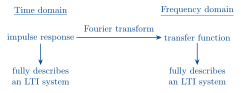{width=420}
:::

For a linear, constant coefficient differential equation

$$ a_n y^{(n)}(t) + a_{n-1}y^{(n-1)}(t) + \dots + a_0 y(t)
   = b_m u^{(m)}(t) + \dots + b_0 u(t) $$

the transfer function is the rational function

$$ \frac{b_m (j\omega)^m + \dots + b_0}
        {a_n (j\omega)^n + a_{n-1}(j\omega)^{n-1} + \dots + a_0}. $$

The roots of the denominator polynomial $a_n s^n + a_{n-1}s^{n-1} + \dots + a_0$, (or more
generally the points $s \in \mathbb{C}$ where $G(s) = \infty$), are called the
<u>poles</u> of the system. They tell us a lot about the system behaviour, as we started
to see last week.

## First and second order systems in the time domain

Last lecture, we looked at the frequency response of 1st and 2nd order systems.

This lecture, we'll start by looking at how these systems behave in the time domain.

We already know what the impulse response of a first order system looks like (from quiz 1):

:::: {.columns}
::: {.column width="48%"}
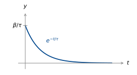{width=340}
:::
::: {.column width="52%"}
$$ \tau\dot{y} = -y + \beta u. \qquad(1) $$

$$
\begin{aligned}
\text{Impulse:}\quad \tau y(0) &= \beta \\[4pt]
y(0) &= \beta/\tau
\end{aligned}
$$

$$ h(t) = \alpha e^{-t/\tau} \quad (t > 0). $$

$$ h(0) = \alpha = \frac{\beta}{\tau}. $$

So $h(t) = \dfrac{\beta}{\tau}e^{-t/\tau}H(t)$.
:::
::::

What about the step response?

Convolve the impulse response with the step.

<!-- KaTeX takes a hex colour; LaTeX cannot, so the red annotations are HTML only. -->
::: {.content-visible when-format="html"}
$$
\begin{aligned}
y(t) &= H(t) * h(t) \\[6pt]
     &= \int_{-\infty}^{\infty}
        \underbrace{H(t-\mu)}_{\textcolor{#C0392B}{0 \text{ for } \mu > t}}\,
        \frac{\beta}{\tau}e^{-\frac{\mu}{\tau}}\,
        \underbrace{H(\mu)}_{\textcolor{#C0392B}{0 \text{ for } \mu < 0}}\,\mathrm{d}\mu \\[6pt]
     &= \int_0^t \frac{\beta}{\tau}e^{-\frac{\mu}{\tau}}\,\mathrm{d}\mu \\[6pt]
     &= \left[-\beta e^{-\frac{\mu}{\tau}}\right]_0^t
      \;=\; \beta - \beta e^{-\frac{t}{\tau}}.
\end{aligned}
$$
:::

::: {.content-visible when-format="pdf"}
$$
\begin{aligned}
y(t) &= H(t) * h(t) \\[6pt]
     &= \int_{-\infty}^{\infty}
        \underbrace{H(t-\mu)}_{0 \text{ for } \mu > t}\,
        \frac{\beta}{\tau}e^{-\frac{\mu}{\tau}}\,
        \underbrace{H(\mu)}_{0 \text{ for } \mu < 0}\,\mathrm{d}\mu \\[6pt]
     &= \int_0^t \frac{\beta}{\tau}e^{-\frac{\mu}{\tau}}\,\mathrm{d}\mu \\[6pt]
     &= \left[-\beta e^{-\frac{\mu}{\tau}}\right]_0^t
      \;=\; \beta - \beta e^{-\frac{t}{\tau}}.
\end{aligned}
$$
:::

Does this answer make sense? Set $\dot{y} = 0$ in (1): $0 = -y + \beta u$, $u = 1$.

::: {style="text-align:center"}
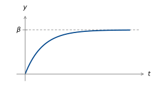{width=380}
:::

What is the significance of the <u>time constant</u> $\tau$?

It tells us how <u>quickly</u> the system rises.

At $t = \tau$,

$$
\begin{aligned}
y(t) &= \beta - \beta e^{-1} \\[4pt]
     &= \beta\left(1 - e^{-1}\right) \\[4pt]
     &\approx 0.63\beta.
\end{aligned}
$$

$\tau$ is the time taken for a 1st order system to reach 63% of its final value.

Two other common metrics are <u>rise time</u> & <u>settling time</u>.

::: {style="text-align:center"}
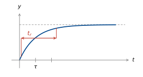{width=400}
:::

rise time: time to go from 10% to 90% of final value, $\approx 2.2\tau$.

settling time: time until output reaches and stays within a specified band, e.g. 5% of
final value.

These performance metrics also apply to second order (and higher order) step responses
(where there isn't a clear time constant).

How do second order step responses look?

:::: {.columns}
::: {.column width="50%"}
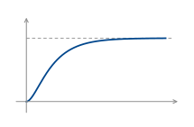{width=320}
:::
::: {.column width="50%"}
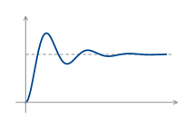{width=320}
:::
::::

How do these relate to pole locations?

$$ \frac{1}{p + j\omega} \;\rightsquigarrow\; e^{-pt}
 = e^{-\operatorname{Re}(p)t}\left(\cos(\operatorname{Im}(p)t) - j\sin(\operatorname{Im}(p)t)\right) $$

::: {style="text-align:center"}
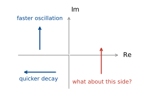{width=400}
:::

## Exponential stability

Recall pole locations from week 1.

:::: {.columns}
::: {.column width="50%"}
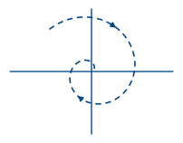{width=280}

$\dot{x} = px$

$p$ in left half plane

$(\operatorname{Re}(p) < 0)$

"stable"
:::
::: {.column width="50%"}
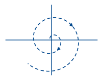{width=280}

$\dot{x} = px$

$p$ in right half plane

$(\operatorname{Re}(p) > 0)$.

"unstable"
:::
::::

"Stable" here means <u>exponential decay from initial conditions</u>.

Formally:

::: {.note}
A differential equation

$$ a_n y^{(n)}(t) + a_{n-1}y^{(n-1)}(t) + \dots + a_0 y(t)
   = b_m u^{(m)}(t) + \dots + b_0 u(t) $$

is said to be <u>exponentially stable</u> if there exist $\alpha > 0$, $M > 0$ such that,
for any initial conditions and $u(t) = 0$,

$$ |y(t)| \le Me^{-\alpha t}\left(|y(0)| + |y'(0)| + \dots + |y^{(n-1)}(0)|\right)
   \quad\text{for all } t > 0. $$
:::

How do we check for stability?

We've already seen that poles in the left half plane give decaying exponentials in the
time domain. It turns out this is enough, although we won't see exactly why until we have
the Laplace transform.

::: {.note}
An LTI system defined by a differential equation is <u>exponentially stable</u> if and
only if all its poles are in the left half plane.
:::


### Example: a damped pendulum with torque input

:::: {.columns}
::: {.column width="58%"}
$$ mL^2\ddot{\theta} + b\dot{\theta} + mgL\sin\theta = \tau $$

Near $\theta = 0$,

$\sin\theta \approx \theta$, so

$$ mL^2\ddot{\theta} + b\dot{\theta} + mgL\,\theta = \tau. $$
:::
::: {.column width="42%"}
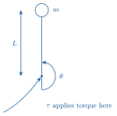{width=200}
:::
::::

::: {.note}
Looks like an RLC circuit?
:::

Find the transfer function:

::::: {.columns}
:::: {.column width="55%"}
$$ mL^2(j\omega)^2\Theta + b\,j\omega\,\Theta + mgL\,\Theta = 1. $$

::: {.note}
<span class="out">F.T. of impulse is 1.</span>
:::
::::
:::: {.column width="45%"}
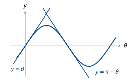{width=300}
::::
:::::

So

$$ G(j\omega) = \frac{1}{mL^2(j\omega)^2 + b(j\omega) + mgL}. $$

Poles are at $\dfrac{-b \pm \sqrt{b^2 - 4m^2L^3g}}{2mL^2}$.


Two cases: If $b^2 - 4m^2L^3g < 0$, (underdamped), real part is $\dfrac{-b}{2mL^2}$.
Stable!


If $b^2 - 4m^2L^3g \ge 0$, (critically/overdamped),

Where is the real part?

$$ b^2 - 4m^2L^3g \le b^2, \quad\text{so}\quad -b \pm \sqrt{b^2 - 4m^2L^3g} \le 0.
   \quad\text{Stable!} $$

What about at $\theta = \pi$?

$\sin\theta \approx \pi - \theta$, so we have

$$ mL^2\ddot{\theta} + b\dot{\theta} + mgL(\pi - \theta) = \tau. $$

Let $\theta - \pi = \phi$. Then we have

$$ mL^2\ddot{\phi} + b\dot{\phi} - mgL\phi = \tau. $$

Transfer function is

$$ G(j\omega) = \frac{1}{mL^2(j\omega)^2 + b(j\omega) - mgL}. $$


So poles are now at
$\dfrac{1}{2mL^2}\left(-b \pm \underbrace{\sqrt{b^2 + 4m^2L^3g}}_{>\,b}\right)$.
Unstable!


## Marginal stability

What about a (downwards pointing) pendulum with no damping?

<!-- \cancel is not in the minimal LaTeX install, so the PDF underbraces instead. -->
::: {.content-visible when-format="html"}
$$ mL^2\ddot{\theta} + \underset{\textcolor{#C0392B}{0}}{\cancel{b\dot{\theta}}}
   + mgL\,\theta = \tau. $$
:::

::: {.content-visible when-format="pdf"}
$$ mL^2\ddot{\theta} + \underbrace{b\dot{\theta}}_{=\,0}
   + mgL\,\theta = \tau. $$
:::

$$ \left(mL^2(j\omega)^2 + mgL\right)\Theta = T $$

$$ G(j\omega) = \frac{1}{mL^2(j\omega)^2 + mgL}
 = \frac{\dfrac{1}{mL^2}}{(j\omega)^2 + \dfrac{g}{L}} $$

Poles at $j\omega = \pm j\sqrt{\dfrac{g}{L}}$.


Let's inverse Fourier transform to see what the impulse response looks like.

From the transform table (quiz 2 formula sheet):

$$ \frac{\omega_0}{(a + j\omega)^2 + \omega_0^2}
   \;\xrightarrow{\;\text{i.f.t.}\;}\;
   e^{-at}\sin(\omega_0 t)H(t) $$

We have $a = 0$, $\omega_0 = \sqrt{\dfrac{g}{L}}$, and an extra factor of
$\dfrac{1}{mL^2\omega_0}$. So in the time domain, we have

$$ h(t) = \frac{\sin(\omega_0 t)}{mL^2\omega_0}H(t), \qquad \omega_0 = \sqrt{\frac{g}{L}}. $$

::: {style="text-align:center"}
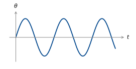{width=400}
:::

::: {.content-visible when-format="html"}
```{=html}
<div id="w-pendulum-undamped" class="widget"></div>
```
:::

::: {.content-visible when-format="pdf"}
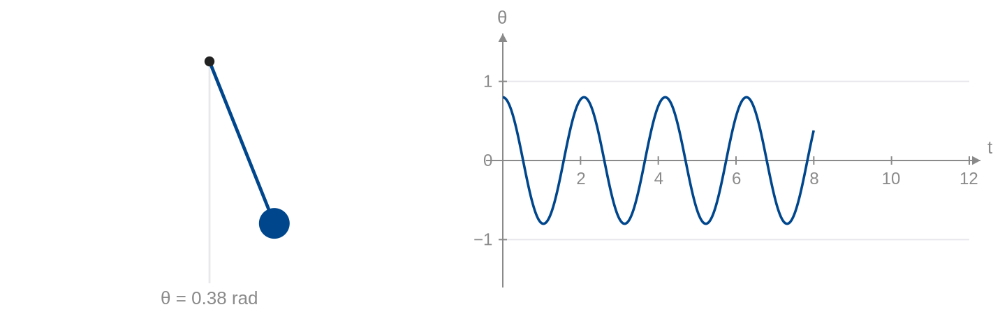{#fig-pendulum-undamped width=100%}
:::

Should we consider this to be stable? Unstable?

↳ it is in the middle: <u>marginally stable</u>.

::: {.note}
A differential equation

$$ a_n y^{(n)}(t) + a_{n-1}y^{(n-1)}(t) + \dots + a_0 y(t)
   = b_m u^{(m)}(t) + \dots + b_0 u(t) $$

is said to be <u>marginally stable</u> if

(1) it is not exponentially stable and

(2) there exists $M > 0$ such that, for $u(t) = 0$ and any initial conditions,

$$ |y(t)| \le Me^{-\alpha t}\left(|y(0)| + |y'(0)| + \dots + |y^{(n-1)}(0)|\right)
   \quad\text{for all } t > 0. $$
:::


### Example

:::: {.columns}
::: {.column width="55%"}
$$
\left.
\begin{aligned}
q &= Cv \\
\dot{q} &= i
\end{aligned}
\right\}
\quad i = \frac{\mathrm{d}}{\mathrm{d}t}Cv.
$$

If $i(t) = 0$, $\dfrac{\mathrm{d}}{\mathrm{d}t}v(t) = 0$:
$\;\boxed{v(t) = v(0)}$.
:::
::: {.column width="45%"}
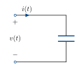{width=170}

$i(t)$ input, $v(t)$ output.
:::
::::

Is this system exponentially stable? Marginally stable?

We can check marginal stability again by looking at the poles of the system:

::: {.note}
An LTI system is <u>marginally stable</u> if and only if:

(1) all poles $p$ have $\operatorname{Re}(p) \le 0$;

(2) at least one pole has $\operatorname{Re}(p) = 0$;

(3) there are no repeated poles with $\operatorname{Re}(p) = 0$.
:::


## BIBO stability

Our definitions of stability so far are <u>internal</u>: they ignore input and output.
But a <u>system</u> is a map from an input signal to an output signal. It doesn't need to
come from a differential equation.

Can we define stability in terms of the inputs and outputs of a system?

One way to do this is "Bounded Input, Bounded Output" stability.

::: {.note}
A system is <u>bounded input, bounded output</u> (BIBO) stable if there exists
$\gamma > 0$ such that

$$ \max_t |y(t)| \le \gamma \max_t |u(t)| $$

whenever $\max_t |u(t)| < \infty$.
:::

### Example: insulin delivery

Insulin blood delivery can be modelled using a "single compartment model".

Let $u(t)$ be intravenous insulin infusion rate in mU/min and $y(t)$ be the plasma
insulin concentration in mU/L.

Let $V$ be plasma volume in L, and $C$ be the rate at which plasma is cleared of insulin
by the body's metabolism, in L/min.

Plasma insulin concentration can be modelled as

$$ V\dot{y}(t) = u(t) - Cy(t). $$

The transfer function is

$$ G(j\omega) = \frac{1}{Vj\omega + C}. $$

::::: {.columns}
:::: {.column width="60%"}
::: {.note}
Note: this is equivalent to an RC circuit. $i(t)$ is the insulin injection, $v(t)$ the
concentration. The plasma is a capacitor with capacitance $V$, and clearance $C$ is the
conductance $\frac{1}{R}$ of the resistor.
:::
::::
:::: {.column width="40%"}
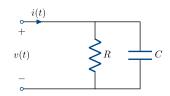{width=230}
::::
:::::

The pole is at $\dfrac{-C}{V}$, so the system is exponentially stable: if we stop insulin
injection, it will gradually decay to zero.

What about BIBO stability?

The impulse response is the inverse Fourier transform of $G(j\omega)$:
$h(t) = \dfrac{1}{V}e^{-\frac{C}{V}t}H(t)$ (This tells us what a shot of insulin at
$t = 0$ does). For any insulin input $u(t)$,

$$ y(t) = h(t) * u(t). $$

We want to show a bound on $|y(t)|$ given one on $|u(t)|$.

$$
\begin{aligned}
|y(t)| &= \left|\int_{-\infty}^{\infty} h(t - \tau)u(\tau)\,\mathrm{d}\tau\right| \\[6pt]
       &\le \int_{-\infty}^{\infty} \left|h(t - \tau)u(\tau)\right|\,\mathrm{d}\tau \\[6pt]
       &= \int_{-\infty}^{\infty} |h(t - \tau)||u(\tau)|\,\mathrm{d}\tau \\[6pt]
       &\le \max_t|u(t)| \int_{-\infty}^{\infty} |h(t)|\,\mathrm{d}t.
\end{aligned}
$$

In our case,

$$
\begin{aligned}
\int_{-\infty}^{\infty}|h(t)|\,\mathrm{d}t
  &= \int_0^{\infty} \frac{1}{V}e^{-\frac{C}{V}t}\,\mathrm{d}t \\[6pt]
  &= \left[\frac{-1}{C}e^{-\frac{C}{V}t}\right]_0^{\infty} = \frac{1}{C}.
\end{aligned}
$$

So $\max_t |y(t)| < \dfrac{1}{C}\max_t|u(t)|$.

It turns out, the condition $\int|h(t)|\,\mathrm{d}t < \infty$ completely characterises
BIBO stability.

::: {.note}
An LTI system is BIBO stable $\iff \displaystyle\int_{-\infty}^{\infty}|h(t)|\,\mathrm{d}t < \infty$.
:::

(Same condition that guarantees existence of the Fourier transform).

Are BIBO stability and exponential stability equivalent? Yes, under mild conditions.

::: {.note}
For the differential equation

$$ a_n y^{(n)}(t) + a_{n-1}y^{(n-1)}(t) + \dots + a_0 y(t)
   = b_m u^{(m)}(t) + \dots + b_0 u(t), $$

exponential stability and BIBO stability are equivalent if $m \le n$ and the polynomials

$$ a_n s^n + a_{n-1}s^{n-1} + \dots + a_0 \quad\text{and}\quad
   b_m s^m + b_{m-1}s^{m-1} + \dots + b_0 $$

share no common roots.
:::

In practice, they are usually equivalent.

We also should give a definition for instability.

::: {.note}
A system is <u>unstable</u> if it is not stable, in any of the senses we have defined so far.
:::

### Example: population dynamics

Let $u(t)$ be net migration rate, $k_r$ be reproduction rate per capita, $k_d$ be death
rate per capita and $y(t)$ be population.

As a differential equation:

$$ \dot{y}(t) = u(t) - k_d y(t) + k_r y(t). $$

Transfer function:

$$ G(j\omega) = \frac{1}{j\omega + (k_d - k_r)} $$

The pole is at $k_r - k_d$.

$k_r = k_d$: marginally stable

$k_r > k_d$: unstable

$k_d > k_r$: stable.

::: {.content-visible when-format="html"}
```{=html}
<div id="w-population" class="widget"></div>
```
:::

::: {.content-visible when-format="pdf"}
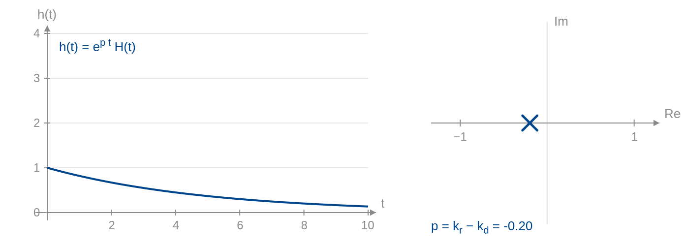{#fig-population width=100%}
:::

## Unstable poles and the Fourier transform

Now let's look a bit closer at unstable poles. We have glossed over something important.

For a stable 1st order sys., $h(t) = e^{-at}H(t)$, we have the Fourier transform

$$
\begin{aligned}
\int_0^{\infty} e^{-at}e^{-j\omega t}\,\mathrm{d}t
 &= \left[\frac{-1}{a + j\omega}e^{-t(a + j\omega)}\right]_0^{\infty} \\[6pt]
 &= \lim_{T \to \infty} \frac{-1}{a + j\omega}e^{-Ta}e^{-Tj\omega}
    + \frac{1}{a + j\omega}e^0
\end{aligned}
$$


$\lim_{T \to \infty} e^{-Ta} = 0$, so we only have the second term.

But for an unstable system, $h(t) = e^{at}H(t)$.

$\lim_{T \to \infty} e^{Ta} = \infty$. The Fourier transform doesn't converge, so how can
we ever have unstable poles in our transfer function, or look at the frequency response
of an unstable system?

We need a more sophisticated transform that still converges: the Laplace Transform.

```{=html}
<script src="stability-widgets.js"></script>
```
