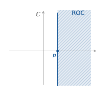
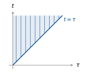

::: {.content-visible when-format="html"}
::: {.format-links}
[Other formats:]{.label}
```{=html}
<a href="notes.pdf" title="Week 8 lecture notes as a PDF"
   data-goatcounter-click="pdf-week8"
   data-goatcounter-title="Week 8 notes PDF opened">&#128196;&nbsp;PDF</a>
```
:::
:::

::: {.content-visible when-format="pdf"}
The figures below are snapshots of interactive widgets. The live versions, where
you can move the sliders yourself, are at
[tchaffey.com/elec2302](https://tchaffey.com/elec2302/?ref=notes-pdf-week8).
:::

## Lecture outline

1. Motivation: unstable systems
2. Making the Fourier transform converge — the bilateral Laplace transform.
3. Least-squares approximation and inverse Laplace transform.
4. Initial conditions and the unilateral Laplace transform.
5. Example
6. Laplace transform properties.

```{=html}
<hr style="border:0;border-top:1.5px solid #00468C;margin:1.6em 0;">
```

## Motivation: unstable systems

Last week we saw that exponential and marginal stability can be determined from the
system poles:

* poles in LHP: stable
* poles (non-repeated) on imaginary axis: marginally stable.

For a single left half plane pole, we have

$$ \frac{1}{p + j\omega} \;\xrightarrow[\text{F.T.}]{\text{Inverse}}\; e^{-pt}H(t) $$

We would guess that, for a right half plane pole,

$$ \frac{1}{-p + j\omega} \;\rightsquigarrow\; e^{pt}H(t). $$

But: The Fourier transform of $e^{pt}H(t)$ is

$$ \int_0^{\infty} e^{pt}e^{-j\omega t}\,\mathrm{d}t = \infty\ldots $$

We need a trick to make this converge, and that is the Laplace transform.

Remember what the Fourier transform is: for each $\omega$,

$$ \int_{-\infty}^{\infty} u(t)e^{-j\omega t}\,\mathrm{d}t $$

projects $u(t)$ onto $e^{+j\omega t}$.

If $u(t)$ decays, this converges. If $u(t)$ grows, it does not.

## Making the Fourier transform converge: the bilateral Laplace transform

The trick in the Laplace transform is to change the basis function: choose a basis
function that <u>decays</u> at least as fast as <u>$u(t)$</u> grows, then the projection
converges.

For $u(t) = e^{pt}H(t)$, what can we do?

Shift $e^{j\omega t}$ <u>to the right</u>:

$$ e^{(\sigma + j\omega)t} = e^{\sigma t}e^{j\omega t}. $$


Then the projection becomes

$$ \int_{-\infty}^{\infty} e^{pt}e^{-\sigma t}e^{-j\omega t}H(t)\,\mathrm{d}t
 = \int_0^{\infty} e^{(p-\sigma)t}e^{-j\omega t}\,\mathrm{d}t. $$

If $\sigma > p$, this converges:

$$
\begin{aligned}
\int_0^{\infty} e^{(p-\sigma)t}e^{-j\omega t}\,\mathrm{d}t
 &= \left[\frac{-1}{\sigma - p + j\omega}\,e^{(p-\sigma-j\omega)t}\right]_0^{\infty} \\[8pt]
 &= \frac{1}{-p + \sigma + j\omega} \\[8pt]
 &= \frac{1}{-p + s}, \qquad \text{where } s = \sigma + j\omega.
\end{aligned}
$$

This shifted Fourier transform is called the bilateral Laplace transform:

$$ \boxed{\; \mathcal{B}(u(t))(s) = \int_{-\infty}^{\infty} u(t)e^{-st}\,\mathrm{d}t \;} $$

::: {style="text-align:center"}
{width=300}
:::

$\sigma > p$ defines the <u>Region of Convergence</u> (ROC), the set $s \in \mathbb{C}$
such that, for a given $u(t)$,

$$ \int_{-\infty}^{\infty} u(t)e^{-st}\,\mathrm{d}t $$

converges.

For a fixed $\sigma \in \text{ROC}$, $\mathcal{B}$ is the Fourier transform of the
weighted signal $u(t)e^{-\sigma t}$. Fixing $\omega$, $\mathcal{B}$ projects this
weighted signal onto the basis function $e^{+j\omega t}$.


If the region of convergence contains the imaginary axis (the signal decays), then we can
take $\sigma = 0$ and

$$ \mathcal{B}(u) = \int_{-\infty}^{\infty} u(t)e^{-j\omega t}\,\mathrm{d}t $$

which is precisely the Fourier transform.

## Least-squares approximation and the inverse Laplace transform

Given a signal $u(t)$ and its Laplace transform $U(s)$, as well as its region of
convergence, we can find the corresponding time domain signal by fixing
$\sigma \in \text{ROC}$ and computing the inverse Fourier transform of the weighted
signal $u(t)e^{-\sigma t}$.

Note first that the Fourier transform of $u(t)e^{-\sigma t}$ is $U(j\omega + \sigma)$
from the Fourier transform properties.

Now, taking the inverse Fourier transform,

$$ u(t)e^{-\sigma t} = \frac{1}{2\pi}\int_{-\infty}^{\infty}
   U(j\omega + \sigma)\,e^{\,j\omega t}\,\mathrm{d}\omega. $$

Divide by $e^{-\sigma t}$ to get

$$ \boxed{\; u(t) = \frac{1}{2\pi}\int_{-\infty}^{\infty}
   U(j\omega + \sigma)\,e^{(\sigma + j\omega)t}\,\mathrm{d}\omega \;} $$

This is the Inverse Laplace Transform. Any $\sigma \in \text{ROC}$ can be used.

::: {.content-visible when-format="html"}
```{=html}
<div id="w-growing" class="widget"></div>
```
:::

::: {.content-visible when-format="pdf"}
{#fig-growing width=100%}
:::

::: {style="text-align:center"}
{width=700}
:::

## Initial conditions and the unilateral Laplace transform

Bilateral refers to the fact that we integrate from $t = -\infty$ to $t = \infty$. Often,
however, we're only interested in a system after we turn it on at $t = 0$, we don't want
to have to keep track of the infinite past. Also, the impulse response of a real system
starts at $t = 0$ (that is, the system is causal, and the output depends only on the
past, not the future). This motivates the <u>unilateral Laplace transform</u>, which only
looks at what happens from $t = 0^- = 0 - \varepsilon$.

$$ \boxed{\; \mathcal{L}(u(t)) = \int_{0^-}^{\infty} u(t)e^{-st}\,\mathrm{d}t
   = \mathcal{B}(u(t)H(t)), \;} $$

::: {.note}
The second equality requires $u$ continuous at $0$.
:::

This transform lets us account for <u>initial conditions</u> as well as inputs. Let's see
how by looking at the Laplace transform of the derivative.

$$ \int_0^{\infty} \frac{\mathrm{d}}{\mathrm{d}t}u(t)\,e^{-st}\,\mathrm{d}t. $$

Integrate by parts:

$$ = u(t)e^{-st}\Big|_0^{\infty} - \int_0^{\infty} -s\,u(t)e^{-st}\,\mathrm{d}t. $$

$\lim_{t \to \infty} e^{-st} = 0$ for $s \in \text{ROC}$, so we have


$$ = -u(0) + s\,U(s). $$

What about the second derivative?

Let $v(t) = \dfrac{\mathrm{d}}{\mathrm{d}t}u(t)$.

Then

$$
\begin{aligned}
\mathcal{L}(v(t)) &= -v(0) + s\,V(s) \\[6pt]
 &= -\frac{\mathrm{d}}{\mathrm{d}t}u(0) - s\,u(0) + s^2\,U(s).
\end{aligned}
$$

By induction,

$$ \boxed{\; \mathcal{L}\left(u^{(n)}(t)\right) = -u^{(n-1)}(0) - s\,u^{(n-2)}(0)
   - \cdots - s^{n-1}u(0) + s^n\,U(s) \;} $$

As with the Fourier transform, we have a table of standard Laplace transforms. The
derivations are very similar to those for the Fourier transforms.


| $u(t)$ | $U(s)$ | ROC |
|---|---|---|
| $\delta(t)$ | $1$ | all $s$ |
| $H(t)$ | $\dfrac{1}{s}$ | $\operatorname{Re}(s) > 0$ |
| $t\,H(t)$ | $\dfrac{1}{s^2}$ | $\operatorname{Re}(s) > 0$ |
| $e^{-at}H(t)$ | $\dfrac{1}{s + a}$ | $\operatorname{Re}(s) > -a$ |
| $t\,e^{-at}H(t)$ | $\dfrac{1}{(s + a)^2}$ | $\operatorname{Re}(s) > -a$ |
| $\cos(\omega_0 t)H(t)$ | $\dfrac{s}{s^2 + \omega_0^2}$ | $\operatorname{Re}(s) > 0$ |
| $\sin(\omega_0 t)H(t)$ | $\dfrac{\omega_0}{s^2 + \omega_0^2}$ | $\operatorname{Re}(s) > 0$ |
| $e^{-at}\cos(\omega_0 t)H(t)$ | $\dfrac{s + a}{(s + a)^2 + \omega_0^2}$ | $\operatorname{Re}(s) > -a$ |
| $e^{-at}\sin(\omega_0 t)H(t)$ | $\dfrac{\omega_0}{(s + a)^2 + \omega_0^2}$ | $\operatorname{Re}(s) > -a$ |

## Example

::: {style="text-align:center"}
{width=560}
:::

A crowbar is an overvoltage protector, which shorts the source if the load voltage exceeds a given threshold.

Suppose the circuit is at steady state and the crowbar is activated at $t = 0$. What is
the capacitor voltage $v(t)$ for $t > 0$?

The current splits through the capacitor and load:

$$ i = C\dot{v} + \frac{v}{R_L}. $$

It is equal to the current through the inductor and resistor.

$$ i = \frac{1}{R}v_R. $$

$$ v_L = L\frac{\mathrm{d}}{\mathrm{d}t}i $$

KVL around the loop:

$$ v(t) + v_L + v_R = 0. $$

Combining:

<!-- KaTeX takes a hex colour; LaTeX cannot, so the red annotations are HTML only. -->
::: {.content-visible when-format="html"}
$$
\begin{aligned}
v + LC\ddot{v} + \frac{L}{R_L}\dot{v} + RC\dot{v} + \frac{R}{R_L}v &= 0
  &&\textcolor{#C0392B}{\text{source is shorted}} \\[8pt]
LC\ddot{v} + \left(\frac{L}{R_L} + RC\right)\dot{v} + \left(1 + \frac{R}{R_L}\right)v &= 0.
\end{aligned}
$$
:::

::: {.content-visible when-format="pdf"}
$$
\begin{aligned}
v + LC\ddot{v} + \frac{L}{R_L}\dot{v} + RC\dot{v} + \frac{R}{R_L}v &= 0
  &&\text{source is shorted} \\[8pt]
LC\ddot{v} + \left(\frac{L}{R_L} + RC\right)\dot{v} + \left(1 + \frac{R}{R_L}\right)v &= 0.
\end{aligned}
$$
:::

Take the Laplace transform:

$$
\begin{aligned}
LC\left(-\dot{v}(0) - s\,v(0) + s^2V(s)\right)
 &+ \left(\frac{L}{R_L} + RC\right)\left(-v(0) + s\,V(s)\right) \\[4pt]
 &+ \left(1 + \frac{R}{R_L}\right)V(s) = 0.
\end{aligned}
$$


Circuit is at steady state at $t = 0$. At DC the inductor is a short and the capacitor
carries no current, so the source drives $R$ and $R_L$ in series:

$$ v(0) = 10\,\frac{R_L}{R + R_L} = 10 \times \frac{100}{102} = 9.804\,\mathrm{V},
   \qquad i(0) = \frac{10}{R + R_L} = 98.04\,\mathrm{mA}. $$

The capacitor current is $i(0) - v(0)/R_L = 0$, so $\dot{v}(0) = 0$.


$$
\begin{aligned}
s^2LC\,V(s) + \left(\frac{L}{R_L} + RC\right)s\,V(s) + \left(1 + \frac{R}{R_L}\right)V(s)
 &= LCs\,v(0) + \left(\frac{L}{R_L} + RC\right)v(0)
\end{aligned}
$$

$$ V(s) = \frac{LCs\,v(0) + \left(\dfrac{L}{R_L} + RC\right)v(0)}
               {s^2LC + \left(\dfrac{L}{R_L} + RC\right)s + \left(1 + \dfrac{R}{R_L}\right)} $$

We now want to inverse transform this expression by breaking it into parts that match
entries in the Laplace transform table.

Normalise so the coefficient of $s^2$ is 1:

$$ V(s) = \frac{v(0)\,s + v(0)\left(\dfrac{1}{CR_L} + \dfrac{R}{L}\right)}
               {s^2 + \left(\dfrac{1}{CR_L} + \dfrac{R}{L}\right)s
                + \left(\dfrac{1}{LC} + \dfrac{R}{R_L LC}\right)} $$

Denote

$$ 2\alpha = \frac{1}{R_L C} + \frac{R}{L}, \qquad
   \omega_0^2 = \frac{1 + R/R_L}{LC}. $$

With the values above, $\alpha = 5100\,\mathrm{s}^{-1}$ and $\omega_0 \approx 10100$.

We now have

$$ V(s) = \frac{v(0)\,s + 2\alpha\,v(0)}{s^2 + 2\alpha s + \omega_0^2} $$

Is the discriminant $> 0$ or $< 0$?

$$ 4\alpha^2 - 4\omega_0^2 = 4(\alpha - \omega_0)(\alpha + \omega_0). $$

$\alpha < \omega_0$, so the system is <u>underdamped</u>.

Complete the square in the denominator:

$$ s^2 + 2\alpha s + \omega_0^2 = (s + \alpha)^2 + (\omega_0^2 - \alpha^2). $$

Let $\omega^2 = \omega_0^2 - \alpha^2$.

Then

$$
\begin{aligned}
V(s) &= \frac{v(0)(s + \alpha) + v(0)\,\alpha}{(s + \alpha)^2 + \omega^2} \\[10pt]
     &= \frac{v(0)(s + \alpha)}{(s + \alpha)^2 + \omega^2}
      + \frac{v(0)\,\alpha}{\omega}\,\frac{\omega}{(s + \alpha)^2 + \omega^2}.
\end{aligned}
$$

Now use the table entries

$$ e^{-\alpha t}\cos\omega t \;\rightsquigarrow\; \frac{s + \alpha}{(s + \alpha)^2 + \omega^2} $$

and

$$ e^{-\alpha t}\sin\omega t \;\rightsquigarrow\; \frac{\omega}{(s + \alpha)^2 + \omega^2} $$

to get

$$ v(t) = e^{-\alpha t}\left(v(0)\cos\omega t
   + \frac{v(0)\,\alpha}{\omega}\sin\omega t\right)H(t). $$

With numbers,

$$ v(t) = e^{-5100t}\left(9.804\cos 8717t + 5.736\sin 8717t\right)H(t). $$

## Properties of the Laplace transform

The Laplace transform inherits many useful properties of the Fourier transform. We have
already seen the derivative property. Let's now check convolution.

Let $y(t) = h(t) * u(t)$. Suppose $h(t) = u(t) = 0$ for $t < 0$.

$$
\begin{aligned}
h(t) * u(t) &= \int_{-\infty}^{\infty} h(t - \tau)u(\tau)\,\mathrm{d}\tau \\[6pt]
            &= \int_0^t h(t - \tau)u(\tau)\,\mathrm{d}\tau.
\end{aligned}
$$

$$ \mathcal{L}\left(h(t) * u(t)\right)
 = \int_0^{\infty}\int_0^t h(t - \tau)u(\tau)\,\mathrm{d}\tau\; e^{-st}\,\mathrm{d}t. $$

If we are in the ROC of both signals, we can swap the order of integration.


:::: {.columns}
::: {.column width="50%"}
{width=320}
:::
::: {.column width="50%"}
{width=320}
:::
::::

::: {.content-visible when-format="html"}
$$ = \int_0^{\infty}\int_{\tau}^{\infty} h(t - \tau)e^{-st}\,\mathrm{d}t\; u(\tau)\,\mathrm{d}\tau
   \qquad \textcolor{#C0392B}{\text{(allowed in the ROC)}}. $$
:::

::: {.content-visible when-format="pdf"}
$$ = \int_0^{\infty}\int_{\tau}^{\infty} h(t - \tau)e^{-st}\,\mathrm{d}t\; u(\tau)\,\mathrm{d}\tau
   \qquad \text{(allowed in the ROC)}. $$
:::

Let $\mu = t - \tau$.

$$
\begin{aligned}
\mathrm{d}\mu &= \mathrm{d}t \\[4pt]
t = \infty &\;\Rightarrow\; \mu = \infty \\[4pt]
t = \tau &\;\Rightarrow\; \mu = 0.
\end{aligned}
$$

$$
\begin{aligned}
 &= \int_0^{\infty}\int_0^{\infty} h(\mu)e^{-s(\mu + \tau)}\,\mathrm{d}\mu\; u(\tau)\,\mathrm{d}\tau \\[8pt]
 &= \int_0^{\infty} h(\mu)e^{-s\mu}\,\mathrm{d}\mu \int_0^{\infty} u(\tau)e^{-s\tau}\,\mathrm{d}\tau \\[8pt]
 &= H(s)\,U(s).
\end{aligned}
$$


### Integration

We can use the convolution property to get the Laplace transform of an integrator:

$$
\begin{aligned}
y(t) &= \int_0^t u(\tau)\,\mathrm{d}\tau \\[6pt]
     &= \int_0^{\infty} H(t - \tau)u(\tau)\,\mathrm{d}\tau \\[6pt]
     &= H * u.
\end{aligned}
$$

So $Y(s) = H(s)U(s)$.

What is the Laplace transform of $H(t)$?

$$
\begin{aligned}
\int_0^{\infty} H(t)e^{-st}\,\mathrm{d}t
 &= \int_0^{\infty} e^{-st}\,\mathrm{d}t \\[6pt]
 &= \left.\frac{-1}{s}e^{-st}\right|_0^{\infty} = \frac{1}{s}.
\end{aligned}
$$

So

$$ \int_0^t u(\tau)\,\mathrm{d}\tau \;\rightsquigarrow\; \frac{1}{s}U(s). $$


### Other properties

| | $u(t)$ | $U(s)$ |
|---|---|---|
| linearity | $\alpha u_1(t) + \beta u_2(t)$ | $\alpha U_1(s) + \beta U_2(s)$ |
| time shift | $u(t - \tau)H(t - \tau)$ | $e^{-s\tau}U(s)$ |
| frequency shift | $e^{at}u(t)$ | $U(s - a)$ |

### Initial value theorem

$$ \mathcal{L}\left(\frac{\mathrm{d}}{\mathrm{d}t}u(t)\right)(s) = s\,U(s) - u(0). $$

So

$$ s\,U(s) = u(0) + \int_0^{\infty} u'(t)e^{-st}\,\mathrm{d}t. $$

Now, if $|u'(t)| \le Me^{ct}$ for some $M, c > 0$, the rightmost term $\to 0$ as
$s \to \infty$ along the real axis, so we have

$$ \lim_{s \to \infty} s\,U(s) = u(0). $$

### Final value theorem

Again take

$$ s\,U(s) = u(0) + \int_0^{\infty} u'(t)e^{-st}\,\mathrm{d}t. $$

Let $s \to 0$ along the real axis. Then

$$ \int_0^{\infty} u'(t)e^{-st}\,\mathrm{d}t = \int_0^{\infty} u'(t)\,\mathrm{d}t
 = \lim_{T \to \infty} u(T) - u(0). $$

So

$$
\begin{aligned}
\lim_{s \to 0} s\,U(s) &= \lim_{T \to \infty} u(T) - u(0) + u(0) \\[6pt]
 &= \lim_{T \to \infty} u(T), \quad \underline{\text{provided this limit exists}}.
\end{aligned}
$$

```{=html}
<script src="laplace-widgets.js"></script>
```
