::: {.content-visible when-format="html"}
::: {.format-links}
[Other formats:]{.label}
```{=html}
<a href="notes.pdf" title="Week 9 lecture notes as a PDF"
   data-goatcounter-click="pdf-week9"
   data-goatcounter-title="Week 9 notes PDF opened">&#128196;&nbsp;PDF</a>
```
:::
:::

::: {.content-visible when-format="pdf"}
The web version of these notes is at
[tchaffey.com/elec2302](https://tchaffey.com/elec2302/?ref=notes-pdf-week9).
:::

## Lecture outline

<u>Last week:</u>

* Laplace transform converges for unstable poles.
* Unilateral Laplace transform integrates from $0$ to $\infty$, and allows us to take care
  of initial conditions.

<u>This week:</u>

* Laplace transform &amp; stability
* Inverse Laplace transforms using partial fractions
* System zeros.

```{=html}
<hr style="border:0;border-top:1.5px solid #00468C;margin:1.6em 0;">
```

## Laplace transform &amp; stability

Previously, we have used the Fourier transform of the impulse response as a transfer
function. The transfer function lets us compute the output by multiplication with the
input:

:::: {.columns}
::: {.column width="50%"}
<u>Time domain</u>

$$ y(t) = \underbrace{h(t)}_{\substack{\text{impulse}\\\text{response}}} * \underbrace{u(t)}_{\text{input}} $$
:::
::: {.column width="50%"}
<u>Frequency domain</u>

$$ Y(j\omega) = \underbrace{H(j\omega)}_{\substack{\text{transfer}\\\text{function}}}\,\underbrace{U(j\omega)}_{\text{input}} $$
:::
::::

This only works when the Fourier transform integral converges, but we saw last week for
the Laplace transform:

$$ y(t) = h(t) * u(t) \;\rightsquigarrow\; Y(s) = H(s)\,U(s). $$

So we can reuse our definition of the transfer function:

::: {.note}
The transfer function of a system is the Laplace transform of its impulse response.
:::

Our previous definition of a transfer function, the Fourier transform of the impulse
response, is usually known as the <u>frequency response</u>.

The Laplace version lets us calculate the transfer function of an unstable system, whose
impulse response grows exponentially:

$$ \mathcal{L}\left(e^{pt}\right)(s) = \frac{1}{s - p}, \qquad p > 0. $$

An unstable impulse response gives a right half plane pole.

We can now complete our stability catalogue:

+--------------------------+------------------------------------------------------------------------------------+
| Exponentially stable:    | poles in the open left half plane                                                  |
+--------------------------+------------------------------------------------------------------------------------+
| Marginally stable:       | poles in the closed left half plane, at least one pole on the imaginary axis, no   |
|                          | repeated poles on the imaginary axis.                                              |
+--------------------------+------------------------------------------------------------------------------------+
| Unstable:                | at least one pole in the right half plane.                                         |
+--------------------------+------------------------------------------------------------------------------------+
| BIBO stable:             | $\displaystyle\int_{-\infty}^{\infty}\lvert h(t)\rvert\,\mathrm{d}t < \infty$      |
+--------------------------+------------------------------------------------------------------------------------+
| Exponential stability $\Rightarrow$ BIBO stability.                                                           |
+--------------------------+------------------------------------------------------------------------------------+
| BIBO stable &amp; no pole/zero cancellations $\Rightarrow$ exponential stability.                             |
+--------------------------+------------------------------------------------------------------------------------+

We can check pole locations by factorising the denominator of the transfer function:

$$ \frac{s - 1}{\underbrace{(s + 1)}_{\text{stable}}\underbrace{(s^2 + s + 1)}_{\text{stable}}\underbrace{(s - 2)}_{\text{unstable}}} $$

To calculate the corresponding time domain response, however, we need to separate into
components in the transform table. This is called Partial Fraction Expansion.

<!-- CHECK: section heading below is not in the handwriting. It is the second item of the
"This week" list on page 1, added so the table of contents has an entry for pages 4–8.
Delete it if unwanted. -->

## Inverse Laplace transforms using partial fractions

### Example 1: simple poles

<!-- CHECK: p4 and p5 write the denominator as s^2 + 2s + 3, but (s+1)(s+2) = s^2 + 3s + 2,
and s^2 + 2s + 3 has complex roots -1 ± j√2. Everything after the first line uses (s+1)(s+2).
Typeset as s^2 + 3s + 2 in both places. -->

$$ \frac{1}{s^2 + 3s + 2} = \frac{1}{(s + 1)(s + 2)}. $$

The residue or cover-up method splits this into two terms:

$$ \frac{A}{s + 1} + \frac{B}{s + 2}. $$

To find $A$: cover up the $s + 1$ part:

::: {.content-visible when-format="html"}
$$ \frac{1}{\colorbox{#555555}{\(\color{white}s+1\)}\,(s + 2)} $$
:::

::: {.content-visible when-format="pdf"}
$$ \frac{1}{\colorbox[HTML]{555555}{\(\color{white}s+1\)}\,(s + 2)} $$
:::

and plug in the value of the covered pole: $s = -1$.

This gives $A = \dfrac{1}{1} = 1$. (This is called a residue in complex analysis).

To find $B$: repeat with the $s + 2$ pole:

::: {.content-visible when-format="html"}
$$ \frac{1}{(s + 1)\,\colorbox{#555555}{\(\color{white}s+2\)}} $$
:::

::: {.content-visible when-format="pdf"}
$$ \frac{1}{(s + 1)\,\colorbox[HTML]{555555}{\(\color{white}s+2\)}} $$
:::

Plug in $s = -2$ to get $B = \dfrac{1}{-1} = -1$.

So we have

$$ \frac{1}{s + 1} - \frac{1}{s + 2}. $$

Let's check this is correct:

<!-- CHECK: p4 writes the numerator as "s+2 − s+1". Typeset with brackets, (s+2) − (s+1),
which gives the 1 on the right. -->

$$ \frac{(s + 2) - (s + 1)}{(s + 1)(s + 2)} = \frac{1}{(s + 1)(s + 2)}, $$

which is what we started with.

We can now calculate the inverse Laplace transform by matching with table entries: in this
case,

$$ \frac{1}{s + p} \;\rightsquigarrow\; e^{-pt}. $$

So the time domain signal corresponding to

$$ \frac{1}{s^2 + 3s + 2} = Y(s) $$

is

$$ y(t) = e^{-t} - e^{-2t}, \qquad t \ge 0. $$

### Example 2: repeated pole

<!-- CHECK: the handwriting labels the source v(t) and the output v_c(t). The text uses
U(s) and Y(s), so the figure is labelled u(t) and y(t) under the course notation. The same
applies to Example 3. -->

::: {style="text-align:center"}
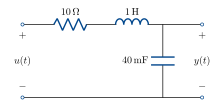{width=420 fig-alt="Series RLC circuit: 10 ohm, 1 H, 40 mF, input u(t), output y(t) across the capacitor."}
:::

Transfer function is

$$ G(s) = \frac{25}{s^2 + 10s + 25}. $$

Input is a step, so $U(s) = \dfrac{1}{s}$.

$$
\begin{aligned}
Y(s) &= G(s)\,U(s) \\[6pt]
     &= \frac{25}{s(s + 5)^2} = \frac{A}{s} + \frac{B}{s + 5} + \frac{C}{(s + 5)^2}.
\end{aligned}
\qquad(1)
$$

We can find $A$ &amp; $C$ using cover-up:

$$ A = \left.\frac{25}{(s + 5)^2}\right|_{s = 0} = 1 $$

$$ C = \left.\frac{25}{s}\right|_{s = -5} = -5. $$

For $B$, from (1) we have

$$ 25 = A(s + 5)^2 + Bs(s + 5) + Cs. $$

The $s^2$ coefficient is $A + B = 0$, so $B = -1$.

So we have

$$ Y(s) = \frac{1}{s} - \frac{1}{s + 5} - \frac{5}{(s + 5)^2}. $$

Using the transform table,

$$ y(t) = 1 - e^{-5t} - 5te^{-5t}, \qquad t \ge 0. $$

### Example 3: complex pair

::: {style="text-align:center"}
{width=420 fig-alt="Series RLC circuit: 6 ohm, 1 H, 40 mF, input u(t), output y(t) across the capacitor."}
:::

Transfer function is

$$ G(s) = \frac{25}{s^2 + 6s + 25}. $$

Input is a step, so $U(s) = \dfrac{1}{s}$.

$$ Y(s) = \frac{25}{s\underbrace{(s^2 + 6s + 25)}}. $$

$$ b^2 - 4ac = 36 - 100 < 0. $$

Underdamped, so the expansion is

$$ Y(s) = \frac{A}{s} + \frac{Bs + C}{s^2 + 6s + 25}. $$

Use cover-up to find $A$:

$$ A = \left.\frac{25}{s^2 + 6s + 25}\right|_{s = 0} = 1. $$

Coefficient matching:

$$ 25 = (s^2 + 6s + 25) + s(Bs + C) $$

$$
\begin{aligned}
s^2 \text{ coefficient:} &\quad 0 = 1 + B. &\quad B &= -1 \\[4pt]
s \text{ coefficient:}   &\quad 0 = 6 + C. &\quad C &= -6.
\end{aligned}
$$

$$ Y(s) = \frac{1}{s} - \frac{(s + 6)}{s^2 + 6s + 25}. $$

Now complete the square:

$$
\begin{aligned}
Y(s) &= \frac{1}{s} - \frac{s + 6}{(s + 3)^2 + 16} \\[8pt]
     &= \frac{1}{s} - \frac{s + 3}{(s + 3)^2 + 16} - \frac{3}{(s + 3)^2 + 16} \\[8pt]
     &= \frac{1}{s} - \frac{s + 3}{(s + 3)^2 + 16} - \frac{3}{4}\,\frac{4}{(s + 3)^2 + 16}.
\end{aligned}
$$

Now match with the table:

$$ y(t) = \left(1 - e^{-3t}\left(\cos 4t + 0.75\sin 4t\right)\right), \qquad t \ge 0 $$

### Example 4

$$ Y(s) = \frac{2s}{(s + 2)(s^2 + 4)} = \frac{A}{s + 2} + \frac{Bs + C}{s^2 + 4}. $$

Cover-up gives

$$ A = \left.\frac{2s}{(s^2 + 4)}\right|_{s = -2} = \frac{-4}{8} = -\frac{1}{2}. $$

Coefficient matching:

$$ 2s = A(s^2 + 4) + (Bs + C)(s + 2). $$

$$
\begin{aligned}
s^2 \text{ coefficient:} &\quad 0 = A + B. &\quad B &= \tfrac{1}{2}. \\[4pt]
s^0 \text{ coefficient:} &\quad 0 = 4A + 2C. &\quad C &= 1.
\end{aligned}
$$

$$ Y(s) = \frac{-\tfrac{1}{2}}{s + 2} + \frac{\tfrac{1}{2}s + 1}{s^2 + 4} $$

$$ y(t) = -\frac{1}{2}e^{-2t} + \frac{1}{2}\cos 2t + \frac{1}{2}\sin 2t, \qquad t \ge 0. $$

### Example 5

$$ Y(s) = \frac{s^2}{s^2 + 6s + 25} $$

$$
\begin{aligned}
Y(s) &= \frac{s^2 + 6s + 25}{s^2 + 6s + 25} - \frac{(6s + 25)}{s^2 + 6s + 25} \\[8pt]
     &= 1 - \frac{6(s + 3) + 7}{(s + 3)^2 + 16} \\[8pt]
     &= 1 - 6\,\frac{s + 3}{(s + 3)^2 + 16} - \frac{7}{4}\,\frac{4}{(s + 3)^2 + 16}
\end{aligned}
$$

$$ y(t) = \delta(t) - e^{-3t}\left(6\cos 4t + \frac{7}{4}\sin 4t\right), \qquad t \ge 0. $$

### Summary table of decompositions

$$
\begin{aligned}
\frac{1}{(s + 1)(s + 2)} &= \frac{A}{s + 1} + \frac{B}{s + 2}. \\[10pt]
\frac{25}{s(s + 5)^2} &= \frac{A}{s} + \frac{B}{s + 5} + \frac{C}{(s + 5)^2}. \\[10pt]
\frac{25}{s(s^2 + 6s + 25)} &= \frac{A}{s} + \frac{Bs + C}{s^2 + 6s + 25}. \\[10pt]
\frac{2s}{(s + 2)(s^2 + 4)} &= \frac{A}{s + 2} + \frac{Bs + C}{s^2 + 4}. \\[10pt]
\frac{s^2}{s^2 + 6s + 25} &= 1 + \frac{As + B}{s^2 + 6s + 25}.
\end{aligned}
$$

## System zeros

So far, we have only looked at the poles of the transfer function (the roots of the
denominator). In the time domain, these give decaying or growing exponentials.

<!-- CHECK: p9 leaves about a third of the page blank at this point. Nothing is typeset
here. If a sketch was meant to go in the gap, it is missing from the source. -->

What about the <u>roots of the numerator</u>? These are called the <u>zeros</u> of the
system.

Intuitively, zeros tell us certain inputs are blocked by the system and don't appear at the
output. Let's see how this works with a couple of examples. We'll use mechanical examples
as they are a lot easier to visualise in this case, but a good exercise is to find
equivalent RLC circuit examples.

### Example 6

::: {style="text-align:center"}
{width=420 fig-alt="Mass m joined to a moving plate by a spring and a damper in parallel. The mass position is y(t) and the plate position is u(t)."}
:::

Damper force is proportional to velocity:

$$ f_d = k_d(\dot{u} - \dot{y}). $$

Spring force is proportional to $y - u$:

$$ f_s = k_s(u - y). $$

Newton's 2nd law:

$$
\begin{aligned}
\ddot{y}m &= f_d + f_s \\[6pt]
          &= k_d(\dot{u} - \dot{y}) + k_s(u - y).
\end{aligned}
$$

Question: can we move the plate so that the damper force and spring force cancel and the
mass stays still?

Intuitively: if the spring is one unit away from rest, the spring pulls it back and the
damper resists this motion. For the forces to match, the closer the plate, the slower it
must move.

Let's try and find this input using the Laplace transform.

<!-- CHECK: p10 has no sign between m ÿ and k_d ẏ. Typeset with +, which follows from
Newton's law on the line above and from the transformed equation below. -->

$$ m\ddot{y} + k_d\dot{y} + k_s y = k_d\dot{u} + k_s u $$

$$
\begin{aligned}
m\left(s^2Y(s) - \dot{y}(0) - sy(0)\right) &+ k_d\left(sY(s) - y(0)\right) + k_sY(s) \\[6pt]
 &= k_d\left(sU(s) - u(0)\right) + k_sU(s).
\end{aligned}
$$

Let's assume $\dot{y}(0) = y(0) = 0$. Then we have:

$$ Y(s) = \frac{(k_ds + k_s)U(s) - k_du(0)}{ms^2 + k_ds + k_s}
   \qquad \left(\text{note the zero at } s = \frac{-k_s}{k_d}\right). $$

So if

$$ U(s) = \frac{k_du(0)}{k_ds + k_s} = \frac{u(0)}{s + \dfrac{k_s}{k_d}}, \qquad Y(s) = 0. $$

In the time domain, this is

$$ u(t) = u(0)e^{-\frac{k_s}{k_d}t}. $$

### Example 7

::: {style="text-align:center"}
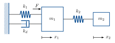{width=520 fig-alt="Mass m1 attached to a wall by spring k1 and damper kd in parallel, driven by force F, with a second mass m2 attached to m1 by spring k2. Positions x1 and x2."}
:::

$$ m_1\ddot{x}_1 + k_d\dot{x}_1 + k_1x_1 + k_2(x_1 - x_2) = F \qquad(2) $$

$$ m_2\ddot{x}_2 + k_2(x_2 - x_1) = 0 \qquad(3) $$

Suppose $x_1(0) = \dot{x}_1(0) = \dot{x}_2(0) = 0$. Is there a combination of $F \ne 0$ and
$x_2(0)$ such that $x_1(t) = 0$ for $t \ge 0$?

Taking the Laplace transform of (3), we have

::: {.content-visible when-format="html"}
$$ m_2\Big(s^2X_2(s) - \underbrace{\cancel{\dot{x}_2(0)}}_{=0} - sx_2(0)\Big) + k_2X_2(s) = k_2X_1(s). $$
:::

::: {.content-visible when-format="pdf"}
$$ m_2\Big(s^2X_2(s) - \underbrace{\dot{x}_2(0)}_{=0} - sx_2(0)\Big) + k_2X_2(s) = k_2X_1(s). $$
:::

The Laplace transform of (2) with zero initial conditions is

$$ m_1s^2X_1(s) + k_dsX_1(s) + k_1X_1(s) + k_2X_1(s) = F(s) + k_2X_2(s). $$

If we set $X_1(s) = 0$ in both equations, we have

$$ m_2\left(s^2X_2(s) - sx_2(0)\right) + k_2X_2(s) = 0 $$

<!-- CHECK: p12 writes k_2/m in the denominator of X_2(s) and of F(s). Typeset as k_2/m_2,
which is what the line above gives and what the cosine frequency uses. -->

$$ X_2(s) = \frac{sx_2(0)}{s^2 + \dfrac{k_2}{m_2}} $$

from (3) and

$$ X_2(s) = \frac{-1}{k_2}F(s). $$

Combining, we have

$$ F(s) = \frac{-sk_2x_2(0)}{s^2 + \dfrac{k_2}{m_2}}. $$

Taking the inverse transform,

$$ F(t) = -k_2x_2(0)\cos\left(\sqrt{\frac{k_2}{m_2}}\,t\right). $$

<!-- CHECK: "the frequency depends only on m_2". The frequency is sqrt(k_2/m_2), so it
also depends on k_2 (it is independent of m_1, k_1 and k_d). Wording left as written. -->

The extra mass completely rejects the sinusoidal input $F$, and the frequency depends only
on $m_2$, so it can be designed independently of $m_1$. This idea is used in vibration
damping, for example tuned mass dampers for earthquake protection in buildings and
Stockbridge dampers on power lines.

## Zeros in the frequency domain

In the frequency domain, zeros are the opposite of poles.

Poles give $-20$ dB/dec gain after the break frequency, and $-\frac{\pi}{2}$ total phase
lag.

:::: {.columns}
::: {.column width="42%"}
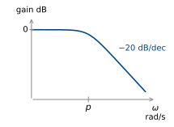{fig-alt="Gain of 1/(s+p): flat at 0 dB, then falling at 20 dB per decade after p."}
:::
::: {.column width="42%"}
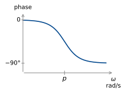{fig-alt="Phase of 1/(s+p): from 0 to −90 degrees, centred on p."}
:::
::: {.column width="16%"}
$$ \frac{1}{s + p} $$
:::
::::

<!-- CHECK: "+π/2 total phase lag". A +π/2 change is a phase lead. Wording left as
written. -->

Zeros give $+20$ dB/dec after the break frequency, and $+\frac{\pi}{2}$ total phase lead.

:::: {.columns}
::: {.column width="42%"}
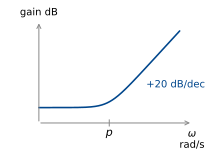{fig-alt="Gain of a zero: flat, then rising at 20 dB per decade after p."}
:::
::: {.column width="42%"}
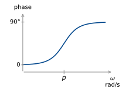{fig-alt="Phase of a zero: from 0 to 90 degrees, centred on p."}
:::
::::

Complex zeros give the opposite behaviour to complex poles.

:::: {.columns}
::: {.column width="42%"}
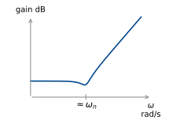{fig-alt="Gain of a complex zero pair: flat, a dip near omega_n, then rising at 40 dB per decade."}
:::
::: {.column width="42%"}
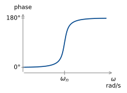{fig-alt="Phase of a complex zero pair: from 0 to 180 degrees, centred on omega_n."}
:::
::::

What about poles &amp; zeros on the imaginary axis?

:::: {.columns}
::: {.column width="42%"}
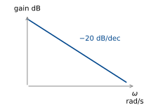{fig-alt="Gain of 1/s: a straight line falling at 20 dB per decade."}
:::
::: {.column width="42%"}
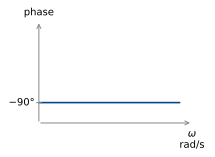{fig-alt="Phase of 1/s: constant at −90 degrees."}
:::
::: {.column width="16%"}
$$ \frac{1}{s} $$
(integrator)
:::
::::

<!-- CHECK: p14 gives no transfer function beside the second row (+20 dB/dec, constant
90°). It is the plot of s. No label typeset. -->

:::: {.columns}
::: {.column width="42%"}
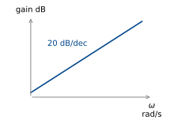{fig-alt="Gain rising in a straight line at 20 dB per decade."}
:::
::: {.column width="42%"}
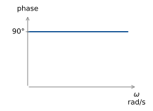{fig-alt="Phase constant at 90 degrees."}
:::
::::

:::: {.columns}
::: {.column width="42%"}
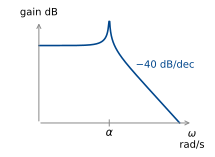{fig-alt="Gain of 1/((jω)^2+α^2): flat, an infinite peak at α, then falling at 40 dB per decade."}
:::
::: {.column width="42%"}
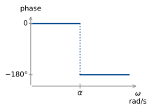{fig-alt="Phase of 1/((jω)^2+α^2): 0 below α, jumping to −180 degrees at α."}
:::
::: {.column width="16%"}
$$ \frac{1}{(j\omega)^2 + \alpha^2} $$
:::
::::

:::: {.columns}
::: {.column width="42%"}
{fig-alt="Gain of (jω)^2+α^2: flat, a notch to minus infinity at α, then rising at 40 dB per decade."}
:::
::: {.column width="42%"}
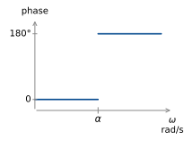{fig-alt="Phase of (jω)^2+α^2: 0 below α, jumping to 180 degrees at α."}
:::
::: {.column width="16%"}
$$ (j\omega)^2 + \alpha^2. $$
:::
::::

We can use these to estimate the Bode diagrams of arbitrary transfer functions.

### Example 8

<!-- CHECK: the handwriting labels the output v(t). Labelled y(t) under the course
notation. -->

::: {style="text-align:center"}
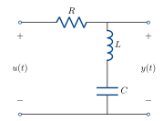{width=340 fig-alt="Series RLC circuit with input u(t) and output y(t) taken across the series inductor and capacitor."}
:::

The frequency response of the series RLC with the output taken as the voltage across the
capacitor and inductor is given by

$$ G(j\omega) = \frac{(j\omega)^2LC + 1}{(j\omega)^2LC + j\omega RC + 1} $$

If we have $R = 6\,\Omega$, $L = 1\,\mathrm{H}$, $C = 40\,\mathrm{mF}$, the transfer
function is

$$ G(j\omega) = \frac{(j\omega)^2 + 25}{(j\omega)^2 + 6j\omega + 25} $$

Numerator:

:::: {.columns}
::: {.column width="42%"}
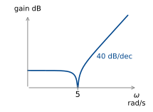{fig-alt="Gain of the numerator: flat, a notch to minus infinity at 5 rad/s, then rising at 40 dB per decade."}
:::
::: {.column width="42%"}
{fig-alt="Phase of the numerator: 0 below 5 rad/s, 180 degrees above."}
:::
::: {.column width="16%"}
$$ (j\omega)^2 + 5^2. $$
:::
::::

Denominator:

:::: {.columns}
::: {.column width="42%"}
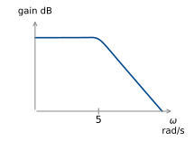{fig-alt="Gain contributed by the denominator: flat with a small peak near 5 rad/s, then falling at 40 dB per decade."}
:::
::: {.column width="42%"}
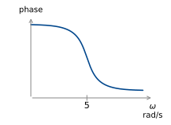{fig-alt="Phase contributed by the denominator: falling from 0 to −180 degrees, centred on 5 rad/s."}
:::
::::

:::: {.columns}
::: {.column width="45%"}
$$ (j\omega)^2 + 6j\omega + 25 $$
:::
::: {.column width="55%"}
$$
\begin{aligned}
\omega_n &= 5\ \text{rad/s}, \\[4pt]
2\zeta\omega_n &= 6 \\[4pt]
\zeta &= \frac{6}{10} = 0.6.
\end{aligned}
$$
:::
::::

<u>Add together:</u>

:::: {.columns}
::: {.column width="42%"}
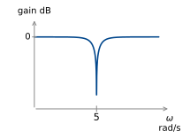{fig-alt="Gain of G: 0 dB except for a deep notch at 5 rad/s."}
:::
::: {.column width="42%"}
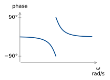{fig-alt="Phase of G: falling towards −90 degrees just below 5 rad/s, jumping to +90 degrees and returning to 0 above it."}
:::
::::

This is a notch filter – it excludes a narrow range of frequencies around 5 rad/s.

More on this next week when we look at filter design!
